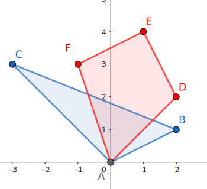

> 本文转载（或修改）自 [OI-Wiki](https://oi-wiki.org/dp/opt/slope/)

## 引入

对于一类二维 DP 问题，如果它的价值函数$f(i,x)$对于每个固定的$i$都是$x$的凸函数，那么将函数$f(i,\cdot)$整体视为$i$处的状态，并维护它的差分（或斜率）

$$
\Delta f(i,x) = f(i,x+1)-f(i,x)
$$

而非函数本身，往往能够起到优化转移的效果。这种优化 DP 的思想，就称为 Slope Trick。

???+ info "「斜率」"
    因为大多数题目中涉及的函数都只在整点处取值，所以称它为差分和斜率没有本质区别，本文按照 Slope Trick 这个名词统一称呼它为斜率。

具体题目中，斜率的维护方式可能各不相同。如果斜率的取值范围较窄，维护斜率变化的点（即拐点）更为方便；而如果函数定义域较窄，维护斜率序列本身可能更为方便。更复杂的情形，可能需要同时维护每段斜率的大小和该段的长度。无论具体维护方式是什么，这类问题的本质都是利用状态转移中斜率序列变化较少这一点简化转移。因此，它们都可以称作 Slope Trick。

## 凸函数

在讨论具体的题目之前，有必要首先了解一下凸函数的基本性质，以及在对凸函数进行各种变换时，它的斜率会如何变化。

### 实轴上的凸函数

凸函数较为一般的定义是在$\mathbf R$上给出的。


???+ abstract "$\mathbf R$上的凸函数 "
    如果函数$f:\mathbf R\rightarrow\mathbf R\cup\{\pm\infty\}$对于所有$x,y\in\mathbf R$和$\alpha\in(0,1)$都满足

    $$
    f(\alpha x+(1-\alpha)y) \le \alpha f(x)+(1-\alpha)f(y),
    $$

    就称函数$f$为 **凸函数**（convex function），其中$\pm\infty$的运算法则规定为$\pm\infty$乘以任何正实数或是加上任何实数都等于其自身，且对于任何实数$x\in\mathbf R$都有$-\infty<x<+\infty$。

当然，如果不等号换作$\ge$，就相应地称它为凹函数[^convex-def]。因为对于凹函数$f$，总有$-f$为凸函数，所以本节只考虑凸函数。

???+ info "本文只考虑正常凸函数"
    为了避免讨论$\infty-\infty$的取值和额外的复杂分析，本文在讨论凸函数相关概念时，总是默认函数不会取到$-\infty$，且不总是$+\infty$。这样的凸函数称为 **正常凸函数**（proper convex function）。这对于理解算法竞赛涉及的内容已经足够。

当然，函数$f$往往并不会对所有实数都有定义。如果函数$f$的定义域仅是$\mathbf R$的子集，那么可以将它拓展为$\mathbf R$上的函数：

$$
\tilde f(x) = \begin{cases} f(x), & x\in\operatorname{dom}f,\\ +\infty,& x\notin\operatorname{dom}f.\end{cases}
$$

此时，称$f$是凸函数，当且仅当相应的$\tilde f$满足上述凸函数的定义。因此，如果没有特别指出，本文提到的凸函数的定义域均是实数集$\mathbf R$。显然，凸函数$f$只能在一个区间（即$\mathbf R$的凸子集）上取得有限值。

???+ question "简单例子"
    常见的凸函数的例子包括：

    -  常数函数：$f(x)=c$，其中$c\in\mathbf R$；
    -  一次函数：$f(x)=kx+b$，其中$k,b\in\mathbf R$且$k\neq 0$；
    -  绝对值函数：$f(x)=|x-a|$，其中$a\in\mathbf R$；
    -   任何凸函数限制在某个区间上的结果，例如$0_{[a,b]}(x)$（在凸分析的语境下也称作$[a,b]$的指示函数）。

当然，可以通过下文提到的保持凸性的变换组合出更为复杂的凸函数。

### 离散点集上的凸函数

算法竞赛中，很多函数仅在部分整数值处有定义。它们在一般情况下并不是（上文定义的）凸函数，因为它们的定义域不再是凸集。为了处理这种情形，需要单独定义离散点集上的函数的凸性。简单来说，需要首先对函数做线性插值，将其定义域拓展到区间，再判断它的凸性。


???+ abstract "离散点集上的凸函数"
    设$S\subset\mathbf R$为离散点集，即对任意闭区间$[a,b]$，$S\cap[a,b]$都是有限集。对于函数$f:S\rightarrow\mathbf R\cup\{\pm\infty\}$，可以定义函数$\tilde f:\mathbf R\rightarrow\mathbf R\cup\{\pm\infty\}$使得：

    -   当$x\in S$时，$\tilde f(x)=f(x)$，
    -   当$x\in(\inf S,\sup S)\setminus S$时，设$s_-=\max\{s\in S:s\le x\}$，$s_+=\min\{s\in S:s\ge x\}$，则

        $$
        \tilde f(x) = \frac{s_+-x}{s_+-s_-}f(s_-)+\frac{x-s_-}{s_+-s_-}f(s_+),
        $$
    -   当$x\notin[\inf S,\sup S]$时，$\tilde f(x)=+\infty$。

    那么，如果$\tilde f(x)$是$\mathbf R$上的凸函数，就称$f(x)$是$S$上的 **凸函数**。

因为$\mathbf R$上的凸函数处理起来更为方便，所以本文在提及凸函数时，若非特别说明，指的都是$\mathbf R$上的凸函数。如果本文中某个函数仅给出了部分整数处的取值，那么它在其他实数处的取值应由定义中的$\tilde f$确定，也就相当于直接讨论对应的分段线性函数$\tilde f$。

整数集$\mathbf Z$上的凸函数有一个更为直观的等价定义：

???+ note "$\mathbf Z$上的凸函数的等价定义 "
    函数$f:\mathbf Z\rightarrow\mathbf R\cup\{\pm\infty\}$是凸的，当且仅当

    $$
    f(x)-f(x-1)\le f(x+1)-f(x)
    $$

    对于所有$x\in\mathbf Z$都成立。

??? tip "证明"
    这个命题是凸函数的斜率刻画的简单推论。

    如果$f$是$\mathbf Z$上的凸函数，那么根据斜率弱增，有

    $$
    \Delta f(x-1,x)\le \Delta f(x-1,x+1) \le\Delta f(x,x+1).
    $$

    这就是上述条件。

    反过来，如果上述条件成立，那么对于任何$x_1<x_2$，都有

    $$
    \Delta f(x_1,x_2) = \frac{1}{x_2-x_1}\sum_{i=x_1}^{x_2-1}\left(f(i)-f(i-1)\right).
    $$

    这相当于对所有满足$x_1\le i<x_2$的差分的算术平均值。如果$x_2$增加一，就相当于插入一项更大的差分；如果$x_1$增加一，就相当于移除一项最小的差分。这两个操作都会使得平均值上升。这就说明斜率$\Delta f(x_1,x_2)$弱增，即$f$是$\mathbf Z$上的凸函数。

也就是说，只要斜率（差分）单调不减，这个序列就可以看作是$\mathbf Z$上的凸函数。

### 凸函数的两种刻画

其实，用斜率刻画凸函数的方式也可以推广到一般情况。

???+ note "凸函数的斜率刻画"
    设$S$为$\mathbf R$或它的离散子集，则函数$f:S\rightarrow\mathbf R\cup\{\pm\infty\}$为凸函数，当且仅当斜率

    $$
    \Delta f(x_1,x_2) = \frac{f(x_2)-f(x_1)}{x_2-x_1}
    $$

    对于任何$x_1,x_2\in S$且$x_1<x_2$都是$x_1$和$x_2$的弱增函数。

??? tip "证明"
    对于$\mathbf R$上的函数$f(x)$以及$x_1<x_2$，对于$\alpha\in(0,1)$，令$x_3=\alpha x_1+(1-\alpha)x_2$，那么

    $$
    \Delta f(x_1,x_3) \le \Delta f(x_1,x_2) \le \Delta f(x_3,x_2)
    $$

    就等价于

    $$
    \frac{f(x_3)-f(x_1)}{1-\alpha} \le f(x_2)-f(x_1) \le \frac{f(x_2)-f(x_3)}{\alpha}.
    $$

    这两侧的不等式都等价于$f(x_3)\le\alpha f(x_1)+(1-\alpha)f(x_2)$，即函数$f(x)$的凸性。

    对于$\mathbf R$的离散子集$S$上的函数$f(x)$，斜率弱增这一条件的必要性可以由$\tilde f(x)$的凸性推导出来。现在要证明它的充分性，为此只要证明$\Delta\tilde f(x_1,x_2)$也是弱增的。设$S=\{s_i\}$且$s_i$关于$i$严格递增，并设$s_{i_1}\le x_1\le s_{i_1+1}$且$s_{i_2}\le x_2\le s_{i_2+1}$，自然有$i_1\le i_2$。令$\Delta_i=\Delta f(s_i,s_{i+1})$，那么，可以证明$\Delta_{i_1}\le\Delta\tilde f(x_1,x_2)\le\Delta_{i_2}$。

    这分两种情形。如果$i_1=i_2$，那么$\Delta_{i_1}=\Delta\tilde f(x_1,x_2)=\Delta_{i_2}$，该不等式显然成立。否则，有

    $$
    \Delta\tilde f(x_1,x_2) = \frac{1}{x_2-x_1}\left((s_{i_1+1}-x_1)\Delta_{i_1}+(x_2-s_{i_2})\Delta_{i_2}+\sum_{j=i_1+1}^{i_2-1}(s_{j+1}-s_j)\Delta_j\right).
    $$

    根据$S$上的斜率递增可知，$\Delta_i$关于$i$递增，所以，$\Delta_{i_1}\le\Delta\tilde f(x_1,x_2)\le\Delta_{i_2}$。

    利用这个结论，对于$x_1<x_2$和$\alpha\in(0,1)$，令$x_3=\alpha x_1+(1-\alpha)x_2$，并取$i_3$使得$s_{i_3}\le x_3\le s_{i_3+1}$成立，则有

    $$
    \Delta\tilde f(x_1,x_3) \le \Delta_{i_3} \le \Delta\tilde f(x_3,x_2).
    $$

    代入$x_3$的表达式，就得到$\tilde f(x)$的凸性。

斜率单调不减，可以看作是凸函数的等价定义。正因为凸函数的斜率具有单调性，在维护斜率时，通常需要选择 堆（优先队列） 或 平衡树 等数据结构。

本文还会用到凸函数的另一种等价刻画。对于函数$f:\mathbf R\rightarrow\mathbf R\cup\{\pm\infty\}$，可以考察平面内函数图像上方的区域，即

$$
\operatorname{epi} f = \{(x,y)\in\mathbf R^2 : y\ge f(x)\}.
$$

这个区域也称为函数$f$的 **上境图**（epigraph）。函数的凸性，等价于它的上境图的凸性：

???+ note "凸函数的上境图刻画"
    函数$f:\mathbf R\rightarrow\mathbf R\cup\{\pm\infty\}$是凸函数，当且仅当$\operatorname{epi}f$是$\mathbf R^2$内的凸集。

??? tip "证明"
    如果$f$是凸函数，那么对于$(x_1,y_1),(x_2,y_2)\in\operatorname{epi}f$和任意$\alpha\in(0,1)$，有

    $$
    \alpha y_1+(1-\alpha)y_2 \ge \alpha f(x_1)+(1-\alpha)f(x_2) \ge f(\alpha x_1+(1-\alpha) x_2).
    $$

    所以，$\alpha(x_1,y_1)+(1-\alpha)(x_2,y_2)\in\operatorname{epi}f$。

    反过来，如果$\operatorname{epi}f$是凸集，那么对于任意$x_1<x_2$以及$\alpha\in(0,1)$，有

    $$
    \alpha(x_1,f(x_1))+(1-\alpha)(x_2,f(x_2)) \in \operatorname{epi}f.
    $$

    这就等价于$\alpha f(x_1)+(1-\alpha)f(x_2)\ge f\left(\alpha x_1+(1-\alpha)x_2\right)$，即$f$的凸性。

稍后会看到，利用上境图，可以将凸函数的卷积下确界与凸集的 Minkowski 和联系起来。

## 凸函数的变换

紧接着，本文介绍一些 Slope Trick 中经常遇见的保持凸性的变换。

### 非负线性组合

对于凸函数$f$和$g$以及非负实数$\alpha,\beta\ge0$，函数$\alpha f+\beta g$也是凸函数。而且，

$$
\Delta(\alpha f+\beta g) = \alpha\Delta f + \beta\Delta g.
$$

因此，如果维护了凸函数$f$和$g$的斜率，要得到它们的非负线性组合$\alpha f+\beta g$的斜率，只需要逐段计算即可。

在维护斜率的问题中，往往其中一个函数的形式比较简单，此时可以通过懒标记的方式降低修改复杂度。在维护拐点的问题中，要计算$f+g$的斜率拐点，只需要将$f$和$g$的斜率拐点合并即可。

### 卷积下确界（Minkowski 和）

凸函数的另一种常见操作是卷积下确界。对于函数$f$和$g$，函数

$$
h(x) = \inf_{y\in\mathbf R}f(y)+g(x-y)
$$

称为$f$和$g$的 **卷积下确界**[^inf-conv]（infimal convolution）。如果$f$和$g$都是凸函数，它们的卷积下确界也是凸函数。


??? tip "对图示的解释"
    如图所示，要求$f$和$g$的卷积下确界$h$，可以将$f$的图像（第三个图的红色虚线）上的每一个点都视作原点，在相应的坐标系内画出$g$的图像（第三个图中的蓝色虚线）。当坐标系原点沿着$f$的图像移动时，$g$的图像（上境图）移动的轨迹轮廓（即下凸壳），就是$h$的图像。可以看出，$h$的每一个斜率段，都要么是$f$的斜率段，要么是$g$的斜率段：只是重新按照斜率大小排序了。这个过程中，$f$和$g$的角色可以互换，即让$f$的图像沿着$g$的图像移动，得到的结果是一致的。

几何直观上，$\operatorname{epi}h$就是$\operatorname{epi}f$和$\operatorname{epi}g$的 Minkowski 和。如果$f$和$g$都是分段线性函数，那么$h$同样是分段线性函数，且它的斜率段可以看作是$f$和$g$的斜率段合并（再排序）的结果。

???+ note "“Minkowski 和” 是什么"
    **定义**

    点集$P$和点集$Q$的闵可夫斯基和$P+Q$定义为$P+Q=\{a+b|a\in P,b\in Q\}$，即把点集$Q$中的每个点看做一个向量，将点集$P$中每个点沿这些向量平移，最终得到的结果的集合就是点集$P+Q$。此处仅讨论 **凸包** 的闵可夫斯基和。

    例如：对于点集$P=\{(0,0),(-3,3),(2,1)\}$和 点集$Q=\{(0,0),(-1,3),(1,4),(2,2)\}$，

    

    将$P$沿$Q$的每个向量平移：

    

    不难发现新图形也是一个 **凸包**：

    

    **性质**

    -  若点集$P$，$Q$为凸集，则其闵可夫斯基和$P+Q$也是凸集。

        ??? tip "证明"
            设$e,f\in P+Q$，有$a,b \in P$，$c,d\in Q$且$e=a+c,f=b+d$，则对任意$t\in[0,1]$均有：

            $$
            \begin{aligned}
            te + (1-t)f &= t(a+c)+(1-t)(b+d)\\
            &=(ta+(1-t)b)+(tc+(1-t)d)\\
            &\in P+Q.
            \end{aligned}
            $$

            证毕。
    -  若点集$P$，$Q$为凸集，则其闵可夫斯基和$P+Q$的边集是由凸集$P$，$Q$的边按极角排序后连接的结果。

        ??? tip "证明"
            不妨假设凸集$P$中任意一条边的斜率与$Q$中任意一条边的斜率均不相同。将坐标系进行旋转，使得$P$上的一条边$XY$与$x$轴平行且在最下方。

            设此时$Q$中最低的点$U$，$P+Q$的 **最低** 且 **靠左** 的点$A$。

            可知$\vec{A} = \vec{X} + \vec{U}$，所以$A$必然在$P+Q$的边界上。

            同理，$P+Q$中 **最低** 且 **靠右** 的点$B$有$\vec{B} = \vec{Y} + \vec{U}$，也必然在$P+Q$的边界上。

            因此，有$\vec{AB} = \vec{XY} + \vec{U}$。

            若按顺序进行旋转，则结果连续的构成了$P+Q$中的每条边。

            证毕。


??? tip "证明"
    设$f,g$都是凸函数，$h$是它们的卷积下确界。设$x_1<x_2$，且$\alpha\in(0,1)$。根据卷积下确界的定义，对任意$\varepsilon>0$，存在$y_i,z_i\in\mathbf R$使得$y_i+z_i=x_i$且

    $$
    h(x_i) + \varepsilon > f(y_i) + g(z_i).
    $$

    故而，结合$f,g$的凸性及$h$的定义，有

    $$
    \begin{aligned}
    \alpha h(x_1)+(1-\alpha)h(x_2) + \varepsilon
    &> \alpha f(y_1) + (1-\alpha) f(y_2) + \alpha g(z_1) + (1-\alpha) g(z_2)\\
    &\ge f\left(\alpha y_1+(1-\alpha)y_2\right) + g\left(\alpha z_1+(1-\alpha)z_2\right)\\
    &\ge h(\alpha x_1+(1-\alpha)x_2).
    \end{aligned}
    $$

    因为$\varepsilon>0$是任意选取的，所以

    $$
    \alpha h(x_1)+(1-\alpha)h(x_2) \ge h(\alpha x_1+(1-\alpha)x_2).
    $$

    这就得到$h$的凸性。

    然后，对于几何直观，严格地说，只能证明如下结论：

    $$
    \operatorname{epi} f + \operatorname{epi} g\subseteq \operatorname{epi}h \subseteq \operatorname{cl}(\operatorname{epi} f + \operatorname{epi} g).
    $$

    其中，$\operatorname{cl}$表示闭包。

    对于任何$(x,y)\in\operatorname{epi} f + \operatorname{epi} g$，都存在$(x_1,y_1)\in\operatorname{epi} f$且$(x_2,y_2)\in\operatorname{epi} g$，使得$x=x_1+x_2$且

    $$
    y = y_1+y_2 \ge f(x_1)+g(x_2) \ge h(x_1+x_2)=h(x).
    $$

    故而，$(x,y)\in\operatorname{epi}h$。这说明$\operatorname{epi} f + \operatorname{epi} g\subseteq \operatorname{epi}h$。

    反过来，对于任何$(x,y)\in\operatorname{epi}h$，有$y\ge h(x)$。根据$h$的定义，对任何$\varepsilon>0$，都存在$x_1+x_2=x$使得

    $$
    y + \varepsilon > f(x_1) + g(x_2).
    $$

    令$y_1=f(x_1)$且$y_2=g(x_2)$，就有$y+\varepsilon>y_1+y_2$。这说明，对于任何$\varepsilon>0$，都有$(x_1,y_1)+(x_2,y_2)\in\operatorname{epi} f + \operatorname{epi} g$位于点$(x,y)$与点$(x,y+\varepsilon)$的连线上。取$\varepsilon\rightarrow 0$，就有$\operatorname{epi}h \subseteq \operatorname{cl}(\operatorname{epi} f + \operatorname{epi} g)$。

    所以，$\operatorname{epi} f + \operatorname{epi} g = \operatorname{epi}h$当且仅当它是闭凸集。一个使其满足的条件是，$f$和$g$都是正常凸函数且 [下半连续](https://en.wikipedia.org/wiki/Semi-continuity)。对于算法竞赛的应用来说，这已经足够了，比如分段线性函数总是满足这些条件的。

在实际问题中，如果$f$和$g$其中一个的斜率段数较少，可以直接将较少的斜率段插入到较多的斜率段中；否则，可能需要利用 [启发式合并](../Graph/DSU%20on%20Tree.md) 或 [可并堆](../DS/左偏树.md) 等方法，降低合并的整体复杂度，或者根据具体问题寻找相应的处理方式。

### 最值操作

两个凸函数的最大值仍然是凸函数，但是，两个凸函数的最小值未必仍然是凸函数。

很多常见的最小值操作可以转化为卷积下确界：

???+ example "例子"
    -  $f(x)=\min_{y\in [x+a,x+b]}g(y)$仍然是凸函数，因为它可以看作是卷积下确界：

        $$
        f(x) = \min_{y\in\mathbf R}g(y) + 0_{[-b,-a]}(x-y).
        $$
    -  $f(x)=\min\{g(x-a_i)+b_i\}$是$\mathbf Z$上的凸函数，只要$g(x)$是$\mathbf Z$上的凸函数，且在有限集合$\{a_i\}\subset\mathbf Z$上定义的函数$h:a_i\mapsto b_i$也是该离散集合上的凸函数。这是因为延拓之后的函数$\tilde f(x)$可以看作是卷积下确界：

        $$
        \tilde f(x) = \min_{y\in\mathbf R}\tilde h(y)+\tilde g(x-y).
        $$

        因此，延拓之前的函数$f(x)$也是凸函数。

但并不是所有的最小值操作都保持凸性。

???+ example "反例"
    设$g(x)$是凸函数，函数$f(x)=\min\{g(x-1)+kx,g(x)\}$并不一定是凸函数。

在一些特殊的问题中，尽管动态规划的转移方程可以写作两个凸函数的最小值的形式，且难以转化为卷积下确界的形式，但是价值函数依然能够保持凸性。在实际处理时，通常需要结合打表和猜测找到这类问题的合理的斜率转移方式。

了解了凸函数及其常见变换后，就可以通过具体的问题理解 Slope Trick 优化 DP 的方法。本文的例题大致分为维护拐点和维护斜率两组，用于理解这两种维护方式的常见操作和实施细节。但是，正如前文所强调的那样，维护方式并不是 Slope Trick 的本质，应当根据具体的问题需要选取合适的斜率段维护方式。

## 维护拐点

这类问题通常出现在需要最小化若干个绝对值的和式的问题中。因为这类问题中，价值函数的斜率的绝对值并不大，因此维护斜率变化的拐点更为方便。

维护拐点是指维护分段线性函数中，斜率发生变化的点。相当于对于每个斜率为$k_i$的斜率段$[l_i,r_i]$，只维护其端点信息，而斜率本身不需要格外维护；因此，这类问题斜率每次发生变化时，都应当只变化一个固定的量。比如，如果维护了拐点集$\xi_{-s}\le\cdots\le\xi_{-1}\le\xi_{1}\le\cdots\le\xi_{t}$，就相当于说：区间$[\xi_{-1},\xi_1]$内斜率为$0$；向左每经过一个拐点，斜率减少一；向右每经过一个拐点，斜率增加一；故而，区间$[\xi_2,\xi_3]$内，斜率就是$2$，区间$[\xi_{-3},\xi_{-2}]$内，斜率就是$-2$，诸如此类。用形式语言表示，函数可以利用斜率拐点写作

$$
f(x) = f(\xi_1) + \sum_{i=-s}^{-1}\max\{\xi_i-x,0\} + \sum_{i=1}^{\ell}\max\{x-\xi_i,0\}.
$$

它的最小值就是$f(\xi_{-1})=f(\xi_1)$，且可以在区间$[\xi_{-1},\xi_1]$内任意位置取到。


### 例题：最小成本递增序列

???+ question "[\[BalticOI 2004\] Sequence 数字序列](https://www.luogu.com.cn/problem/P4331)"
    给定长度为$n$的序列$\{a_i\}$，求严格递增序列$\{b_i\}$使得$\sum_i|a_i-b_i|$最小，输出最小值和任意一种最优方案$\{b_i\}$。

??? tip "解答"
    首先，$\{b_i\}$严格递增，等价于$\{b'_i\}=\{b_i-i\}$弱增。因此，可以对$\{a'_i\}=\{a_i-i\}$求出差值最小的弱增序列$\{b'_i\}=\{b_i-i\}$再恢复成序列$\{b_i\}$即可。

    考虑朴素 DP 解法。设$f_i(x)$是已经选取了序列$\{b'_i\}$中前$i$个数字，且第$i$个数字不超过$x$时，已经选取的数字与$\{a'_i\}$的前$i$个数字的最小差值：

    $$
    f_i(x) = \min\sum_{j=1}^i|a'_j-b'_j|\text{ s.t. }b'_1\le b'_2\le\cdots\le b'_i\le x.
    $$

    容易得到状态转移方程为

    $$
    f_i(x) = \min_{y\le x}f_{i-1}(y)+|a'_i-y|.
    $$

    初始状态为$f_0(x)\equiv 0$，最后要求的就是$\min_xf_n(x)$。利用前文提到的凸函数的变换，从$f_{i-1}(x)$到$f_i(x)$，需要经过两步变换：

    -  首先，加上$|a'_i-x|$，这相当于对区间$(-\infty,a'_i]$内的所有斜率段都增加$-1$，对区间$[a'_i,+\infty)$内的所有斜率段都增加$1$；
    -  对得到的函数取最小值，将$g(x)=f_{i-1}(x)+|a'_i-x|$变为$f_i(x)=\min_{y\le x}g(y)$。根据前文分析，这相当于对$g(x)$和$0_{[0,+\infty)}$做卷积下确界。因为后者的斜率段只有一段，斜率为$0$且向右延伸至无限长，将其插入$g(x)$的斜率段中，相当于删除其中所有正斜率段。

    明晰了这些操作后，已经可以直接用平衡树维护所有斜率段了，但代码较复杂。注意到问题中斜率每次变化至多$1$，故而所有斜率段的绝对值都不超过$n$。不直接维护斜率段，转而直接维护斜率拐点更为方便。

    设$f_{-1}(x)$的拐点集为$\xi_{-k}\le\cdots\le\xi_{-1}\le\xi_{1}\le\cdots\le\xi_{\ell}$。那么，上面的两步操作分别对应：

    -  增加一个负斜率段的拐点$a'_i$和一个正斜率段的拐点$a'_i$；
    -  弹出所有正斜率段的拐点$\xi_1,\cdots,\xi_{\ell}$。

    实际维护时，因为每次操作结束后都没有正斜率段的拐点，即斜率拐点具有形式$\xi_{-k}\le\cdots\le\xi_{-1}$，而且操作总发生在正负斜率段交界处，所以直接维护一个最大堆存储所有拐点即可。两步操作分别对应：

    -  插入两次$a'_i$；
    -  弹出堆顶。

    当然，每次结束后都需要维护当前函数的最小值。因为操作结束后，没有正斜率段，函数最小值就是它在最大堆堆顶处的取值。设每次操作之前堆顶为$\xi_{-1}$，最小值为$f_{i-1}(\xi_{-1})$。因为弹出的堆顶是正斜率段的最小拐点，函数的最小值就等于该处函数的取值，所以直接计算弹出前堆顶处函数的取值即可，亦即

    $$
    f_{i-1}(\max\{a'_i,\xi_{-1}\})+|\max\{a'_i,\xi_{-1}\}-a'_i|=f_{i-1}(\xi_{-1})+\max\{0,\xi_{-1}-a'_i\}.
    $$

    其中，第一项相等是因为$f_{i-1}(x)$没有正斜率段。因此，每次只需要在最小值上不断累加$\max\{0,\xi_{-1}-a'_i\}$即可。

    本题还要求输出一种最优方案。因为最后操作结束时，最优解就是堆顶，所以$b'_n$的取值可以直接确定。如果已经知道了第$i$个最优解$b'_i$，要求解$f_{i-1}(x)$满足$x\le b'$的最优解，只需要注意到因为$f_{i-1}(x)$是凸的，所以越接近它的全局最小值点，解就越优，故而只要记录$f_{i-1}(x)$的全局最小值点，并将它与$b'_i$取最小值，就可以得到最优的$b'_{i-1}$。

    时间复杂度为$O(n\log n)$。

??? code "实现"
    ```cpp
    --8<-- "docs/DP/code/P4331.cpp"
    ```

### 例题：转移带限制的情形

???+ question "[\[NOISG 2018 Finals\] Safety](https://www.luogu.com.cn/problem/P11598)"
    给定长度为$n$的序列$\{a_i\}$，求序列$\{b_i\}$使其满足$|b_i-b_{i-1}|\le h$对所有$1<i\le n$都成立，并使得$\sum_i|a_i-b_i|$最小，输出最小值。

??? tip "解答"
    内容大致与上一个题目相仿，只是序列$\{b_i\}$的限制发生了变化。同样地，设$f_i(x)$为第$i$个数字取$x$时，前$i$个数字的差值的最小值：

    $$
    f_i(x) = \min\sum_{j=1}^i|a_j-b_j|\text{ s.t. }|b_{j-1}-b_j|\le h,\forall 1<j\le i,~b_i=x.
    $$

    由此，有状态转移方程为

    $$
    f_i(x) = |a_i-x| + \min_{|y-x|\le h} f_{i-1}(y).
    $$

    起始条件为$f_0(x)\equiv 0$。最后要求的仍然是$\min_xf_n(x)$。

    状态转移拆解为对凸函数的操作，分两步：

    -  首先对$f_{i-1}(x)$取最值，变为$\min_{|y-x|\le h} f_{i-1}(y)$，这相当于$f_{i-1}(x)$与$0_{[-h,h]}(x)$的卷积下确界；
    -  再将得到的函数与$|a_i-x|$相加。

    同样因为斜率每次只变化一，可以考虑维护拐点。这样，这两步操作就可以描述为：

    -  将所有负斜率段向左移动$h$，将所有正斜率段向右移动$h$；
    -  插入两次$a_i$。

    显然，对于本题，将正负斜率段分别维护较为方便。因为操作主要集中在零斜率段附近，因此考虑使用 对顶堆，即分别用最大堆和最小堆维护负斜率段和正斜率段的拐点。拐点的整体平移操作用懒标记完成。因为第二步操作需要分别对两个堆插入一个$a_i$，而且，插入完成后，未必最大堆的堆顶仍然小于等于最小堆的堆顶。此时，交换两堆顶，直到堆顶的大小关系得到满足即可。

    最后，考虑操作过程中如何更新最小值。因为第一步平移操作并不会改变最小值，所以只要考虑交换堆顶的操作即可。设$\xi_{-1}>\xi_1$，将堆顶$\xi_{-1}$与$\xi_1$交换时，函数由

    $$
    \max\{0,x-\xi_{-1}\}+\max\{0,x-\xi_1\}
    $$

    变为

    $$
    \max\{0,x-\xi_{1}\}+\max\{0,x-\xi_{-1}\}.
    $$

    过程中，函数形状不变，只是向下平移了$|\xi_{-1}-\xi_1|$。因此，要使得交换堆顶前后函数保持不变，只需要将最小值累加$|\xi_{-1}-\xi_1|$即可。

    算法的时间复杂度仍为$O(n\log n)$，因为每次添加元素后，交换堆顶的操作至多执行一次。

??? code "实现"
    ```cpp
    --8<-- "docs/DP/code/P11598.cpp"
    ```

## 维护斜率

还有一些问题，维护斜率（也叫维护差分）更为方便。这类问题通常也可以使用 反悔贪心 或模拟费用流的思想解决。费用流模型中，最小费用往往是流量的凸函数，这就为使用 Slope Trick 提供了基础。

### 例题：股票交易问题

???+ question "[Codeforces 865 D. Buy Low Sell High](https://codeforces.com/problemset/problem/865/D)"
    给定$n$天股票价格序列$\{p_i\}$（均为正数），初始持股为$0$，每天可买入一股、卖出一股或不交易，求$n$天后最大利润。

??? tip "解答"
    首先考虑朴素 DP 解法。设$f_i(x)$为第$i$天结束时持有股票数量为$x\ge 0$的最大利润，则

    $$
    f_i(x) = \max\{f_{i-1}(x-1)-p_i,f_{i-1}(x),f_{i-1}(x+1)+p_i\}.
    $$

    初始状态为$f_0(0)=0$，且对所有$x\neq 0$，有$f_0(x)=-\infty$。问题的答案就是$f_n(0)$。

    从$f_{i-1}(x)$到$f_i(x)$需要经过两步变换：

    -  将$f_{i-1}(x)$与函数

        $$
        h_i(x) = \begin{cases}p_i,&x=-1,\\0,&x=0,\\-p_i,&x=1\end{cases}
        $$

        对应的分段线性函数$\tilde h(x)$（显然是凹函数）做卷积上确界；
    -  因为这样会导致函数在区间$[-1,0)$内具有有限值，这与$x\ge 0$的要求矛盾，故而需要截取函数在$[0,+\infty)$内的部分。

    将它们转化为斜率段的变化，就是如下两步：

    -  插入长度为$2$、斜率为$-p_i$的斜率段；
    -  删除斜率有限的斜率段中，斜率最大且长度为$1$的一段。

    因为斜率段的长度总是自然数，所以不妨维护若干个长度为一的斜率段，从而只需要记录每段的斜率即可。因为只需要插入和访问最大值操作，所以只需要一个最大堆。操作分两步：

    -  插入两次$-p_i$；
    -  弹出堆顶。

    还需要维护$f_i(0)$的值。因为第一步操作得到的函数在$x=-1$处的取值就是$f_{i-1}(0)+p_i$，所以它在$x=0$处的取值就是该值加上马上要弹出的堆顶——它就是函数在区间$[-1,0]$上的斜率。因为截断不改变函数在$x=0$处的取值，所以这就是$f_i(0)$。

    对比该算法实现与上文 [最小成本递增序列](#例题最小成本递增序列) 的代码可知，该算法等价于求将股票价格变为弱递减序列的最小成本。

    时间复杂度为$O(n\log n)$。

??? code "实现"
    ```cpp
    --8<-- "docs/DP/code/CF865D.cpp"
    ```

### 例题：搬运土石问题

???+ question "[\[USACO16OPEN\] Landscaping P](https://www.luogu.com.cn/problem/P2748)"
    给定长度为$n$的序列$\{a_i\}$和$\{b_i\}$，分别表示第$i$个花园已经有的泥土数量和需要的泥土数量（不能多也不能少）。购买一单位泥土放入任意花园价格为$X$，从任意花园运走一单位泥土价格为$Y$，从花园$i$向花园$j$运送一单位泥土价格为$Z|i-j|$。求满足所有花园需求的最小成本。（$a_i,b_i\le 10$）

??? tip "解答"
    考虑朴素 DP 解法。设$f_i(x)$为满足前$i$个花园需求且净剩余$x$单位泥土运到后面的花园时的最小代价。如果$x<0$，就相当于净亏空$|x|$单位泥土需要从后面的花园运送过来。那么，可以写成状态转移方程为

    $$
    f_i(x) = \min_{y\in\mathbf R} f_{i-1}(y) + |y|Z + h((x-y)+(b_i-a_i)).
    $$

    其中，函数$h(\delta)$表示当前花园的泥土净购买量为$\delta$时的成本，即

    $$
    h(\delta) = \max\{0,\delta\}X + \max\{0,-\delta\}Y = \max\{\delta X,-\delta Y\}.
    $$

    它显然是凸函数。该状态转移方程的含义为

    -   之前$i-1$个花园净剩余泥土数量为$y$时，最小成本为$f_{i-1}(y)$；
    -   将净剩余（亏空）的泥土数量在$i$与$i-1$之间运送的成本为$|y|Z$；
    -   通过买卖，将第$i$个花园的泥土数量从$a_i$调整为$b_i$，并将净剩余泥土数量从$y$调整到$x$，最小成本为$h((x-y)+(b_i-a_i))$。

    初始状态为$f_0(0)=0$，且对所有$x\neq 0$，有$f_0(x)=+\infty$。问题的答案就是$f_n(0)$。

    将函数$f_{i-1}(x)$变换为$f_i(x)$可以分为三步：

    -  首先，加上$|x|Z$，得到$f_{i-1}(x)+|x|Z$；
    -  然后，与$h(x)$做卷积下确界，得到$\min_{y\in\mathbf R}f_{i-1}(y)+|y|Z+h(x-y)$；
    -  最后，将函数向左平移$(b_i-a_i)$个单位。

    转化为对斜率段的操作，同样分为三步：

    -  将原点左侧斜率段全体加上$-Z$，将原点右侧斜率段全体加上$Z$；
    -  将所有小于$-Y$的斜率段全部替换为$-Y$，将所有大于$X$的斜率段全部替换为$X$；
    -  将所有斜率段向左平移$(b_i-a_i)$个单位。

    原题中$a_i$和$b_i$很小，因此只需要维护若干个长度为$1$的斜率段即可。虽然斜率段有无穷多个，但是有上界$X$和下界$-Y$，且严格位于两者之间的斜率段数目并不多。因为不涉及插入操作，所以可以用两个栈维护原点两侧的斜率段，区间加和区间最值操作全部打懒标记完成。上述三步操作分别对应：

    -  对左右两个栈分别打懒标记，左侧加$-Z$，右侧加$Z$；
    -  每次栈内弹出元素时，都对$-Y$取最大值，对$X$取最小值。如果左栈为空，则弹出$-Y$。如果右栈为空，则弹出$X$；
    -  将左栈顶部的$(b_i-a_i)$个元素弹出，插入右栈；当然，$b_i-a_i<0$时，就反过来。

    在交换栈顶时，更新答案，向左移动就减去当前斜率，向右移动就加上当前斜率。

    算法复杂度为$O(n\max\{a_i,b_i\})$。

??? code "实现"
    ```cpp
    --8<-- "docs/DP/code/P2748.cpp"
    ```

## 习题

本文的最后，提供一些各类算法竞赛中出现过的且可以使用 Slope Trick 解决的问题，以供练习。

??? question "[P3642 [APIO2016] 烟花表演](https://www.luogu.com.cn/problem/P3642)"
    烟花表演是最引人注目的节日活动之一。在表演中,所有的烟花必须同时爆炸。为了确保安全，烟花被安置在远离开关的位置上，通过一些导火索与开关相连。导火索的连接方式形成一棵树，烟花是树叶，如图所示。火花从开关出发，沿导火索移动。每当火花抵达一个分叉点时，它会扩散到与之相连的所有导火索，继续燃烧。导火索燃烧的速度是一个固定常数。图中展示了六枚烟花 $\{E_1, E_2, \dots, E_6\}$ 的连线布局，以及每根导火索的长度。图中还标注了当在时刻 $0$ 从开关点燃火花时，每一发烟花的爆炸时间。

    

    Hyunmin 为烟花表演设计了导火索的连线布局。不幸的是，在他设计的布局中，烟花不一定同时爆炸。我们希望修改一些导火索的长度，让所有烟花在同一时刻爆炸。例如，为了让图中的所有烟花在时刻 $13$ 爆炸，我们可以像下图中左边那样调整导火索长度。类似地，为了让图中的所有烟花在时刻 $14$ 爆炸，我们可以像下图中右边那样调整长度。

    

    修改导火索长度的代价等于修改前后长度之差的绝对值。例如，将上面那副图中布局修改为下面那副图的左边布局的总代价为 $6$，而修改为右边布局的总代价为 $5$。

    导火索的长度可以被减为 $0$，同时保持连通性不变。

    给定一个导火索的连线布局，你需要编写一个程序，去调整导火索长度，让所有的烟花在同一时刻爆炸，并使得代价最小。

    数据范围：$1 \leq N+M \leq 300000$。

    ??? tip "分析"
        首先有一个很显然的DP方程

        设$f_{u,x}$为以$u$为根的子树中结束时间统一为$x$的最小代价，有$f_{u,x} = \sum \min_{y \leq x} (f_{v,y} + |w - x + y|)$

        于是有了一个$O(n(\sum w)^2)$的方程

        接下来，我们考虑把$f_u$的所有点值写成函数的形式$f_u(x)$

        考虑$f_u(y)$对父亲$f_u(x)$的贡献

        首先，我们发现这个函数每一段的斜率一定是单调递增的，并且斜率为整数。于是$f_u(y)$的最优取值就是斜率为 $0$ 的一段，记为$[L, R]$。接下来，记$f_u$对于$f_u(x)$的贡献函数为$F_u(x)$，记$u \to v$的边权为$w$

        根据$F_u$的定义，我们可以知道$F_u(x) = \min_{y \leq x} (f_u(y) + |w - x + y|)$

        接下来，我们可以分三类来讨论一下：

        - 当$x$很小的时候，最优情况一定是把$w$修改为 $0$（由于修改$w$一定比下面每一个都修改优）

        具体来说就是$x < L$时，$F_u(x) = f_u(x) + w$一定最优，因为$f_u(x)$在$x < L$时为单调降函数，且斜率小于等于 $-1$，于是$w$必缩短$k$，则$f_u$的增加量一定之$k$，于是$w$修改为 0 时取到最优解

        - 当$x$很大的时候，和上种情况类似，最优情况一定要把$w$拉长

        具体来说就是$x > R + w$时，$F_u(x) = f_u(R) + x - R - w$一定最优，因为$f_u(x)$在$x > R$时为单调升函数，且斜率大于等于 $1$，于是$w$少拉长$k$，$f_u$的增加量一定之$k$，又$f_u$在$[L, R]$内都能取到最优值，所以$w$拉长到$x - R$时取到最优解

        - 当$x$适中的时候，我们可以调整$w$小的值使$F_u$取到最优，我们可以继续分两类讨论

        1）这种情况不常用修改即可取到最优值，具体来说，$L + w \leq x \leq R + w$时，$F_u(x) = f_u(x - w)$一定最优，因为$w$不修改，那么修改$w$的代价取到了最小，同时由于$x - w \in [L, R]$，$f_u(x - w)$也取到了最小，那么这就是最优值

        2）这种情况需要修改，并且一定是缩小（拉伸属于$x$情况），具体来说，$L \leq x < L + w$时，$F_u(x) = f_u(L) + w - x + L$，原因与$L$情况相同，只是这里没有必要把$w$修改为 $0$（原因是$w$多修改了以后$f_u$不会因此减少）

        于是我们可以把这几种情况整理一下，得：

        $$F_u(x) =
        \begin{cases}
        f_u(x) + w & (x < L) \\
        f_u(L) + w - x + L & (L \leq x < L + w) \\
        f_u(x - w) = f_u(L) & (L + w \leq x \leq R + w) \\
        f_u(R) + x - R - w & (x > R + w)
        \end{cases}$$

        考虑$F_u$对于$f_u$的变化关系

        - $x < L$时，$f_u$往上平移$w$单位即可

        - $L \leq x < L + w$时，在向上平移$w$的基础上需要把斜率修改为 $-1$

        - $L + w \leq x \leq R + w$时，将原先$[L, R]$的函数平移到$[L + w, R + w]$即可

        - $x > R + w$时，把这段函数的斜率统一修改为 $1$

        又容易发现$F_u$是连续的，于是我们在存储这段函数的时候只需要存储$F_u$的各个拐点即可

        于是，我们修改$F_u$只需要把$L$和$L$之后的所有拐点全部删除，新加入$L + w$，$R + w$两个拐点即可

        与$f_u$合并时，我们只需要把这些拐点序列直接和$f_u$本身拥有的拐点序列合并，并且不去重，因为重复多次的拐点可以表示这个点左右两边的斜率为$k$

        又拐点横坐标单调下降，我们很容易可以想到用可并的大根推来维护这个函数

        接下来还有两个问题

        -  如何从可并中找到斜率为 $0$ 的区间的两个拐点$L, R$

        我们发现每次修改的$F$函数中，斜率为正的拐点有且仅有一个$(R + w)$，而一个函数$f_u$会合并几千个数$k_0$，也就是说$f_u$中有$k_0$个斜率为正的拐点，于是弹出$k_0 - 1$个，剩下的第一个就是$R$，下一个就是$L$

        -  如何计算答案

        我们知道了根节点（$1$ 号节点）的函数拐点集合，又知道了$f_1(0)$时的取值（所有边的取值），又知道了一个拐点和下一个拐点对应的函数斜率为 $1$，于是我们就可以轻松地算出答案了

        可并推出左偏好实现即可，复杂度$O((n+m)\log(n+m))$

        另外有一个细节就是左偏好的节点要开两位大小，因为每次把$f$修改成$F$都要新建两个节点

    ??? code "实现"
        ```cpp
        --8<-- "docs/DP/code/P3642.cpp"
        ```

??? question "[P9962 [THUPC 2024 初赛] 一棵树](https://www.luogu.com.cn/problem/P9962)"
    这里有一棵树，具体的，这是一张有 $n$ 个节点和 $n-1$ 条边组成的无向联通图。

    每个节点初始颜色为白色，你需要恰好将其中 $k$ 个节点染成黑色，定义一条边的权值是，断开这条边之后，两个连通块的黑色节点个数之差，定义一棵树的权值为所有边的权值求和，你需要最小化整棵树的权值。

    数据范围：$1\leq k\leq n\leq 5\times 10^5$。

    ??? tip "分析"
        注意到当前询问形如权值为边权的权值求和，考虑树形 dp，直接的 dp 为$f_{i,j}$表示$i$子树内有$j$个黑色节点的最小代价。

        有转移是易于计算的，子树的合并是树形背包的合并$f_{x,j+k} = \min(f_{x,j} + f_{to,k})$，考虑当前点$x$到父亲这条边的代价是多少。

        注意到，形如如果当前子树有$A$个黑点，子树外有$k - A$个白点，代价为$|2A - k|$。

        观察函数的形式，你注意到如果将$x$坐标作为黑点个数，$y$坐标作为代价，则每次代价增量为一个下凸函数，有树形背包合并不影响函数凸性。

        注意到凸函数的维护可以尝试维护其差分数组，两个下凸函数做 min 卷积可以之际的视作差分数组的归并。

        现在需要考虑的问题是住父亲方向的增量怎么处理。

        考虑代价增量的差分，形如一段前缀差分为负数，一段后缀差分为正数，中间一个点根据$k$的奇偶性讨论是否存在差分$=0$。

        有这一段前缀的长度总为定长度$\frac{k}{2}$于是我们维护可并堆顶堆，使得左侧堆大小始终为前缀定长度，然后可以打加法标记实现。

        总复杂度$O(n \log n)$，具体实现中，采用大根堆插入相反数的方式实现小根堆。

    ??? code "实现"
        ```cpp
        --8<-- "docs/DP/code/P9962.cpp"
        ```

??? question "[P12074 [OOI 2025] The arithmetic exercise](https://www.luogu.com.cn/problem/P12074)"
    Oleg 和 Dasha 参加了一场团队竞赛，但不幸的是，他们未能解决任何问题。Oleg 立刻意识到他们的队伍训练不足。然后，他们共同的朋友提出了一个有趣的练习。这个练习相当简单，要解决它，只需要知道整数加减法的规则。

    给定一个长度为 $n$ 的数组 $a$，初始时所有值均为零。同时给定 $m$ 个数 $x_1, x_2, \ldots, x_m$。然后，对于从 $1$ 到 $m$ 的每个 $i$，你需要选择某个下标 $j_i$，并执行更改 $a_{j_i} = x_i - a_{j_i}$。

    请帮助 Oleg 和 Dasha 确定，如果每次选择都最优，那么在所有更改完成之后，数组 $a$ 的元素之和的最大值可能为多少。

    本题有 $T$ 组测试数据。

    数据范围：$T \leq 10^4, N, M \leq 3 \times 10^5, |x_i| \leq 10^9$，其中 $N = \sum n, M = \sum m$。

    ??? tip "分析"
        我们先来讨论$N \leq 2000, M \leq 2000$的做法。我们可以将原问题看成一个如下的过程：有$n$个栈，依次按顺序处理$m$个数，对于每个数我们可以任选一个栈把栈里所有的数符号取反，并把当前数压入栈中。但是这个过程中涉及对之前的数符号的更改，难以直接处理。我们发现，将整个过程按从$m$到$1$的相反方向处理，就不再涉及符号的更改，我们只要考虑当前数符号是否改变，并始终保持未取反的数个数减去取反的数的个数在$[0, n]$范围内即可。我们很容易设计出一个$dp_i$设$dp_{i,j}$表示后$i$个数中，取反个数减去未取反个数为$j$，那么转移方程式为：

        $$dp_{i,j} =
        \begin{cases}
        dp_{i-1,j+1} - x_i, & j = 0 \\
        max\{dp_{i-1,j-1} + x_i, dp_{i-1,j+1} - x_i\}, & 0 < j < n \\
        dp_{i-1,j-1} + x_i, & j = n
        \end{cases}$$

        边界情况：

        $$dp_{0,j} =
        \begin{cases}
        0, & j = 0 \\
        -\infty, & 0 < j \leq n
        \end{cases}$$

        再考虑正解，我们考虑优化这个 DP，这看起来很像 Slope Trick。当$i$固定时，我们可以发现$dp_{i,j}$是一个关于$j$的上凸包，动态规划的转移实际上就是这个凸包与一个点数为 $2$ 的凸包作图可夫斯基和。我们便可以使用一个 `multiset` 维护相邻节点的差值，并用另一个变量维护第一个点的具体数值是多少，最后对所有点取最大值就可以了。

    ??? code "实现"
        ```cpp
        --8<-- "docs/DP/code/P12074.cpp"
        ```

[^convex-def]: 不同教材对于凸函数的称呼可能不同。

[^inf-conv]: 也常称为$\min$卷积、$\inf$卷积或者$(\min,+)$卷积。
