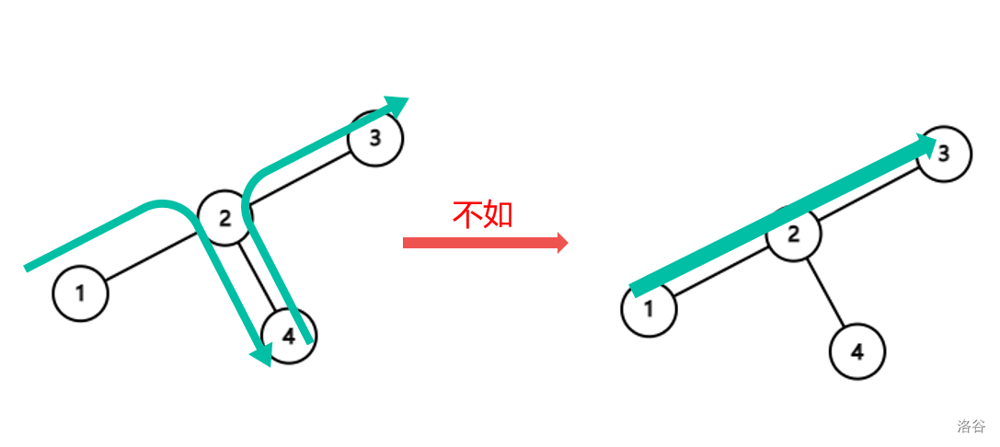
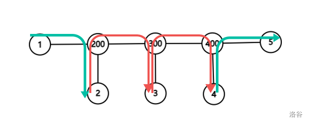

动态DP又名DDP，是2018年集训队成员猫锟在他的论文中提出的黑科技，是矩阵乘法的又一大应用。

DDP的转移方程都不难写，难的是到矩阵的转化。

???+ question "[P4719 【模板】动态 DP](https://www.luogu.com.cn/problem/P4719)"
    给定一棵 $n$ 个点的树，点带点权。

    有 $m$ 次操作，每次操作给定 $x,y$，表示修改点 $x$ 的权值为 $y$。

    你需要在每次操作之后求出这棵树的最大权独立集的权值大小。

    - 对于 $100\%$ 的数据，保证 $1\le n,m\le 10^5$，$1 \leq u, v, x \leq n$，$-10^2 \leq a_i, y \leq 10^2$。

如果没有修改操作，这题就是 [P1352 没有上司的舞会](https://www.luogu.com.cn/problem/P1352)。

对于有修改的情况怎么办呢？

我们考虑利用树剖的方法加速，简单修改一下状态，设 $f_{i, 0}$ 为不选 $i$ 的答案，设 $f_{i, 1}$ 为选 $i$ 的答案，为了区分重儿子和轻儿子，我们再令 $g_{i, 0}$ 为不选 $i$ 时轻儿子能造成的最大贡献，$g_{i, 1}$ 为选 $i$ 时轻儿子能造成的最大贡献，那么设重儿子为 $j$，$a_i$ 为点权，就有

$$
\begin{aligned}
    f_{i, 0} &= \max(f_{j, 0}, f_{j, 1}) + g_{i, 0} \\
    f_{i, 1} &= f_{j, 0} + g_{i, 1} + a_i
\end{aligned}
$$

这里使用一个小技巧，类似参变分离，我们合并 $g_{i, 1}$ 与 $a_i$，即令 $g_{i, 1}$ 为选 $i$ 时轻儿子能造成的最大贡献再加上 $a_i$，那么有新的方程

$$
\begin{aligned}
    f_{i, 0} &= \max(f_{j, 0}, f_{j, 1}) + g_{i, 0} \\
    f_{i, 1} &= f_{j, 0} + g_{i, 1}
\end{aligned}
$$

那如何再优化呢？

我们发现 $f$ 和 $g$ 之间的关系都是一次式，只涉及 $\max$ 和 $+$，回想一下矩阵快速幂加速递推，能不能也这么做呢？

我们定义新的矩阵乘法 $* = (\max, +)$，设 $C = A * B$，那么

$$
C_{i, j} = \max\{A_{i, k} + B_{k, j}\}
$$

代码就是：

???+ code "$*$ 运算的实现"
    ```cpp
    struct Matrix
    {
        ll val[2][2];
        ll *operator[](const int x) { return val[x]; }
        Matrix() { val[1][1] = val[1][0] = val[0][1] = val[0][0] = -inf; }
    };
    inline void chkmx(ll &a, ll b) { a = a < b ? b : a; }
    Matrix operator*(Matrix a, Matrix b)
    {
        Matrix c;
        for (int i = 0; i <= 1; i++)
            for (int j = 0; j <= 1; j++)
                for (int k = 0; k <= 1; k++)
                    chkmx(c[i][j], a[i][k] + b[k][j]);
        return c;
    }
    ```

感性理解+手玩几把后发现这玩意有结合律！

那么我们令转移矩阵为 $\boldsymbol{T_i}$，我们希望它满足

$$
\begin{bmatrix}
    f_{i, 0} \\
    f_{i, 1}
\end{bmatrix} =
\boldsymbol{T_i} *
\begin{bmatrix}
    f_{j, 0} \\
    f_{j, 1}
\end{bmatrix}
$$

那么可以推导出

$$
\boldsymbol{T_i} =
\begin{bmatrix}
    g_{i, 0}, g_{i, 0} \\
    g_{i, 1}, -\infty \\
\end{bmatrix}
$$

每次修改时，先改一个点的 $\boldsymbol{T_i}$，由于链头的 $g$ 会对他父亲的 $g$ 产生影响，因此也要接着修改。

这样我们可以树剖+线段树维护区间矩阵乘法即可。

但是还有一些特殊的地方，首先，每次查询应该是一条完整的链相乘，因此我们还要记录每条链的末尾。

其次，这里的矩阵更新不能直接覆盖，因为 $g$ 是所有轻儿子的共同贡献。

因此我们考虑一种增量式的修改，我们计算每次修改后 $g$ 的变化量，这个只与修改点有关。

具体的，我们先 `query` 得到之前的矩阵，然后再 `update` 修改，再 `query` 修改后的矩阵，计算贡献的增量即可。

还有，我们初始化所有矩阵的时候由于线段树还没建起来，因此我们要在 `dfs2` 的时候做一遍朴素的DP。

这样就 $O(m \log n)$ 搞定了，代码如下：

??? code "实现"
    ```cpp
    --8<-- "docs/DP/code/P4719.cpp"
    ```

## 例题

???+ question "[P5024 [NOIP 2018 提高组] 保卫王国](https://www.luogu.com.cn/problem/P5024)"
    Z 国有 $n$ 座城市，$(n - 1)$ 条双向道路，每条双向道路连接两座城市，且任意两座城市都能通过若干条道路相互到达。

    Z 国的国防部长小 Z 要在城市中驻扎军队。驻扎军队需要满足如下几个条件：

    - 一座城市可以驻扎一支军队，也可以不驻扎军队。
    - 由道路直接连接的两座城市中至少要有一座城市驻扎军队。
    - 在城市里驻扎军队会产生花费，在编号为 $i$ 的城市中驻扎军队的花费是 $p_i$。

    小 Z 很快就规划出了一种驻扎军队的方案，使总花费最小。但是国王又给小 Z 提出了 $m$ 个要求，每个要求规定了其中两座城市是否驻扎军队。小 Z 需要针对每个要求逐一给出回答。具体而言，如果国王提出的第 $j$ 个要求能够满足上述驻扎条件（不需要考虑第 $j$ 个要求之外的其它要求），则需要给出在此要求前提下驻扎军队的最小开销。如果国王提出的第 $j$ 个要求无法满足，则需要输出 $-1$。现在请你来帮助小 Z。

    对于 $100\%$的数据，保证 $1 \leq n,m ≤ 10^5$，$1 ≤ p_i ≤ 10^5$，$1 \leq u, v, a, b \leq n$，$a \neq b$，$x, y \in \{0, 1\}$。

??? tip
    这题只需要一个小转化就可以无脑DDP水过。

    首先需要知道一点（不知道也无所谓，转移方程也不难推）：

    ???+ "引理"
        最小权覆盖集 $=$ 全集 $-$ 最大权独立集。

    类比最大流最小割定理一样感性理解即可。

    然后如果一个城市必须驻扎，那么就将其权值 $-10^{13}$，因为全集最大权不超过 $10^{10}$。

    同理，如果一个城市不能驻扎，那么就将其权值 $+10^{13}$。

    无解的情况很好判断，就是一条边两端都不能驻扎军队，这个看 `fa` 数组即可。

    DDP求得答案对 $10^{13}$ 取模就行了，记得把权值改回来。

    ??? code "实现"
        ```cpp
        --8<-- "docs/DP/code/P5024.cpp"
        ```

???+ question "[P8820 [CSP-S 2022] 数据传输](https://www.luogu.com.cn/problem/P8820)"
    小 C 正在设计计算机网络中的路由系统。

    测试用的网络总共有 $n$ 台主机，依次编号为 $1 \sim n$。这 $n$ 台主机之间由 $n - 1$ 根网线连接，第 $i$ 条网线连接个主机 $a_i$ 和 $b_i$。保证任意两台主机可以通过有限根网线直接或者间接地相连。受制于信息发送的功率，主机 $a$ 能够直接将信息传输给主机 $b$ 当且仅当两个主机在可以通过不超过 $k$ 根网线直接或者间接的相连。

    在计算机网络中，数据的传输往往需要通过若干次转发。假定小 C 需要将数据从主机 $a$ 传输到主机 $b$（$a \neq b$），则其会选择出若干台用于传输的主机 $c_1 = a, c_2, \ldots, c_{m - 1}, c_m = b$，并按照如下规则转发：对于所有的 $1 \le i < m$，主机 $c_i$ 将信息直接发送给 $c_{i + 1}$。

    每台主机处理信息都需要一定的时间，第 $i$ 台主机处理信息需要 $v_i$ 单位的时间。数据在网络中的传输非常迅速，因此传输的时间可以忽略不计。据此，上述传输过程花费的时间为 $\sum_{i = 1}^{m} v_{c_i}$。

    现在总共有 $Q$ 次数据发送请求，第 $i$ 次请求会从主机 $s_i$ 发送数据到主机 $t_i$。小 C 想要知道，对于每一次请求至少需要花费多少单位时间才能完成传输。

    对于所有的测试数据，满足 $1 \le n \le 2 \times {10}^5$，$1 \le Q \le 2 \times {10}^5$，$1 \le k \le 3$，$1 \le a_i, b_i \le n$，$1 \le s_i, t_i \le n$，$s_i \ne t_i$。

??? tip
    注意到 $k$ 很小，我们由易到难分讨一下：

    **$k = 1$ 的部分分**

    简单的链上求和，没啥好说的。

    **$k = 2$ 的部分分**

    注意到我们并不会这样走：
    
    因此我们设 $f_i$ 为跳到第 $i$ 个点的最小值，就有 $f_i = \min(f_{i-1}, f_{i-2}) + v_i$

    **$k = 3$ 的部分分**

    现在就和上面有区别了，上面被我们舍弃的情况有可能恰恰就是正解：
    

    经过一些小修正，我们可以发现，当 $k=3$ 时，最优方案中只可能存在路径上的点和他们的一个儿子 $u$。我们这里把 LCA 的父亲结点也当作它的儿子之一。

    显然这个儿子需要满足不在路径上，而且它的权值也要最小。事实上，它要么是最大值，要么是次大值。把路径提取出来后，我们可以方便的 $O(n)$ 把这玩意求出来。设 $num_i$ 表示 $i$ 儿子的权值，如果没有则设为 $\infty$。

    设 $f_{i,0}$ 和 $f_{i,1}$ 表示跳到了点 $i$ 自己 / 它儿子的最小值，枚举它从哪个点跳过来，可以得到：

    $$
    \begin{cases}
    f_{i,0} = \min(f_{i-1,0}, f_{i-1,1}, f_{i-2,0}, f_{i-2,1}, f_{i-3,0}) + val_i \\
    f_{i,1} = \min(f_{i,0} + num_i, \min(f_{i-1,0}, f_{i-1,1}, f_{i-2,0}) + num_i)
    \end{cases}
    $$

    这两个部分的时间复杂度均为 $O(n)$，其中 $n$ 为树的深度。

    至此，你已经得到了 76pts 的好成绩。

    再往下就是解决 $k=3$ 的正解情况了。对于部分分，它的时间复杂度瓶颈在于一次 $O(n)$ 的动态规划。我们必须着手去优化它。

    考虑 DDP。定义矩阵乘法 $\otimes = (\min, +)$，它满足结合律。

    对于 $k=2$ 的情况，转移矩阵非常好处理，甚至根本不需要转移矩阵。这里为了与下文统一，用的是 $3 \times 3$ 的矩阵。

    $$
    \begin{bmatrix}
    val_i & \infty & \infty \\
    \infty & 0 & \infty \\
    \infty & \infty & 0
    \end{bmatrix}
    \otimes
    \begin{bmatrix}
    dis_{i-1} & 0 & 0 \\
    0 & 0 & 0 \\
    0 & 0 & 0
    \end{bmatrix}
    =
    \begin{bmatrix}
    dis_i & 0 & 0 \\
    0 & 0 & 0 \\
    0 & 0 & 0
    \end{bmatrix}
    $$

    对于 $k=3$ 的情况，它的状态转移方程也容易写成矩阵形式：

    $$
    \begin{bmatrix}
    val_i & 0 & \infty \\
    val_i & \infty & \infty \\
    \infty & \infty & 0
    \end{bmatrix}
    \otimes
    \begin{bmatrix}
    f_{i-1} & f_{i-2} & 0 \\
    0 & 0 & 0 \\
    0 & 0 & 0
    \end{bmatrix}
    =
    \begin{bmatrix}
    f_i & f_{i-1} & 0 \\
    0 & 0 & 0 \\
    0 & 0 & 0
    \end{bmatrix}
    $$

    但是，当 $k=3$ 时，我们需要存 $f_{i}, f_{i-1}, f_{i-2}$ 这五个值，一次转移就有 $O(5^3)$ 的常数，即使是 3s 的时限也难以接受。这个时候就必须要优化状态设计。

    可以发现，整个 DP 中影响转移的只有一个因素——距离。设 $f_{i,0}, f_{i,1}, f_{i,2}$ 表示跳到距离点 $i$ 为 0/1/2 的点的最小值，则有：

    $$
    \begin{cases}
    f_{i,0} = \min(f_{i-1,0}, f_{i-1,1}, f_{i-1,2}) + val_i \\
    f_{i,1} = \min(f_{i,0} + num_i, \min(f_{i-1,0}, f_{i-1,1}) + num_i) \\
    f_{i,2} = f_{i-1,1}
    \end{cases}
    $$

    把中间的 $f_{i,1}$ 拆开，再把式子整理一下，可以得到：

    $$
    \begin{cases}
    f_{i,0} = \min(f_{i-1,0}, f_{i-1,1}, f_{i-1,2}) + val_i \\
    f_{i,1} = \min(f_{i-1,0}, f_{i-1,1} + num_i, f_{i-1,2} + val_i + num_i) \\
    f_{i,2} = f_{i-1,1}
    \end{cases}
    $$

    接下来给出 $k=3$ 的转移矩阵：

    $$
    \begin{bmatrix}
    val_i & 0 & \infty \\
    val_i & num_i & 0 \\
    val_i & num_i + val_i & \infty
    \end{bmatrix}
    \otimes
    \begin{bmatrix}
    f_{i-1,0} \\
    f_{i-1,1} \\
    f_{i-1,2}
    \end{bmatrix}
    =
    \begin{bmatrix}
    f_{i,0} \\
    f_{i,1} \\
    f_{i,2}
    \end{bmatrix}
    $$

    我们把路径上第 $i$ 个点的转移矩阵称为 $base_i$。根据动态 DP 的套路，设路径长度为 $k$，整个转移过程如下：

    $$
    \begin{bmatrix}
    f_{k,0} \\
    f_{k,1} \\
    f_{k,2}
    \end{bmatrix}
    = base_k \otimes base_{k-1} \otimes \cdots \otimes base_2 \otimes
    \begin{bmatrix}
    f_{1,0} \\
    f_{1,1} \\
    f_{1,2}
    \end{bmatrix}
    $$

    答案就是除开第一个点外的转移矩阵逆序积再乘上初始的转移矩阵。

    利用倍增预处理出从点 $u$ 往上跳 $2^j$ 级祖先之和的矩阵顺序乘积和逆序乘积，询问就可以直接解决了。

    等等...是不是有点问题？

    对于每条路径，$num_i$ 的值有可能不同。如何保证 $u$ 不在路径上？

    通过观察，可以发现，$num_i$ 的意义实际上就是给一个结点挂一个值为 $num_i$ 的儿子。如果 $u$ 在路径上，那么最优方案一定不会经过 $u$ 的任何一个儿子。因为对于走到 $u$ 儿子的方案，要么一定不优，要么可以把儿子替换成 $u$，方案合法的同时答案仍然不劣。

    所以直接预处理出 $num_i$ 为 $i$ 直接连接的结点中权值最小值即可。

    这种方法的分类讨论和细节都是较少的。时间复杂度 $O(n \log n)$。

    ??? code "实现"
        ```cpp
        --8<-- "docs/DP/code/P8820.cpp"
        ```