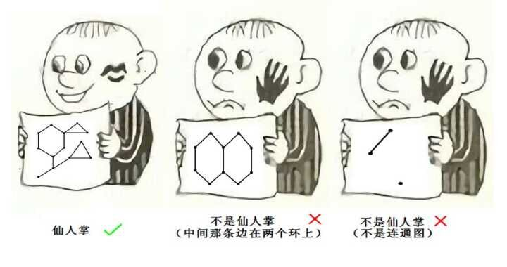

> 前置知识：[圆方树](./圆方树.md)

如下图所示，任意一条边至多只出现在一条简单回路的无向连通图称为仙人掌。



由仙人掌图的定义，我们不难想到应用圆方树来解决仙人掌图的问题。

???+ question "[P5236 【模板】静态仙人掌](https://www.luogu.com.cn/problem/P5236)"
    给你一个有 $n$ 个点和 $m$ 条边的仙人掌图，和 $q$ 组询问。

    每次询问两个点 $u,v$，求两点之间的最短路。

    保证输入数据没有重边。

    $1\le n,q \le 10000$；

    $1\le m \le 20000$；

    $1\le w \le 10^5$。

    保证输入数据没有重边。

    请注意时限为 $300\text{ms}$。

圆方树的建点、连边规则是这样的：

1. 原图中的点都是圆点。

2. 对于每个环，新建一个方点；这个方点和环上其它圆点连成菊花图。

3. 对于不在环上的两个圆点，保留原图中的边。

根据仙人掌的性质，易证不存在相邻的两个方点。

考虑确定树的边权。

从一个点开始dfs，对于$u \rightarrow v$的边：

- 若$u$、$v$都是圆点，则权为原图中边权。

- 若$u$为方点，则权值为$v$到$u$父亲的最短路。

- 否则权值为$0$。

对于每个环，建一个方点，然后圆方树就搞好了

现在我们建好了树，就要考虑用它来求解

和普通的求树上路径一样，我们在求$u \rightarrow v$的最短路时，要求出$lca(u,v)$，设其为$p$。

我们进行分类讨论：

- 若$p$为圆点，那答案就是树上这两点的距离。

- 若$p$为方点，则需要找出$p$的两个儿子$A$、$B$，分别是$u$和$v$的祖先。由于$A$、$B$在一个环上，所以$dis(A,B)$可以直接求（两种情况取$min$）。此时答案为$dis(A,B)+dis(A,u)+dis(B,v)$。

这题的主要思路大概就是这样了。

至于找$p$的儿子$A$、$B$，那很简单。在找$lca(u,v)$时顺便求出来就好了。

时间复杂度$O(q \log n)$。

??? code "实现"
    ```cpp
    --8<-- "docs/Graph/code/P5236.cpp"
    ```