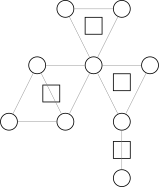

> 前置知识：[Tarjan 求解连通分量](./连通分量.md)

## 引入

众所周知，树（或森林）有很好的性质，并且容易通过很多常见数据结构维护。

而一般图则没有那么好的性质，所幸有时我们可以把一般图上的某些问题转化到树上考虑。

而圆方树（Block forest 或 Round-square tree）就是一种将图变成树的方法。本文将介绍圆方树的构建，性质和一些应用。

限于篇幅，本文中有一些结论未经证明，读者可以自行理解或证明。

## 定义

圆方树最初是处理「仙人掌图」（每条边在不超过一个简单环中的无向图）的一种工具，不过发掘它的更多性质，有时我们可以在一般无向图上使用它。

要介绍圆方树，首先要介绍 **点双连通分量**。

一个 **点双连通图** 的一个定义是：图中任意两不同点之间都有至少两条点不重复的路径。
点不重复既指路径上点不重复（简单路径），也指两条路径的交集为空（当然，路径必然都经过出发点和到达点，这不在考虑范围内）。

可以发现对于只有一个点的图比较难定义它是不是一个点双，这里先不考虑节点数为 $1$ 的图。

一个近乎等价的定义是：不存在割点的图。
这个定义只在图中只有两个点，一条连接它们的边时失效。它没有割点，但是并不能找到两条不相交的路径，因为只有一条路径。
（也可以理解为那一条路径可以算两次，的确没有交，因为不经过其他点）

虽然原始的定义的确是前者，但是为了方便，我们规定点双图的定义采用后者。

而一个图的 **点双连通分量** 则是一个 **极大点双连通子图**。
与强连通分量等不同，一个点可能属于多个点双，但是一条边属于恰好一个点双（如果定义采用前者则有可能不属于任何点双）。

在圆方树中，原来的每个点对应一个 **圆点**，每一个点双对应一个 **方点**。
所以共有 $n+c$ 个点，其中 $n$ 是原图点数，$c$ 是原图点双连通分量的个数。

而对于每一个点双连通分量，它对应的方点向这个点双连通分量中的每个点连边。
每个点双形成一个「菊花图」，多个「菊花图」通过原图中的割点连接在一起（因为点双的分隔点是割点）。

显然，圆方树中每条边连接一个圆点和一个方点。

下面的图显示了一张图对应的点双和圆方树形态。



圆方树的点数小于 $2n$，这是因为割点的数量小于 $n$，所以请注意各种数组大小要开两倍。

其实，如果原图连通，则「圆方树」才是一棵树，如果原图有 $k$ 个连通分量，则它的圆方树也会形成 $k$ 棵树形成的森林。

如果原图中某个连通分量只有一个点，则需要具体情况具体分析，我们在后续讨论中不考虑孤立点。

## 过程

对于一个图，如何构造出它的圆方树呢？首先可以发现如果图不连通，可以拆分成每个连通子图考虑，所以我们只考虑连通图。

圆方树基于双连通分量，求双连通分量的常用算法是 Tarjan 算法。

我们介绍圆方树使用的算法（其实是 Tarjan 求双连通分量的变体）：

Tarjan 求双连通分量可以模仿求强连通分量，考虑点双和 DFS 树以及这两个数组之间的关联，可以发现，每个点双在 DFS 树上是一棵连通子树，并至少包含两个点；特别地，最顶端节点仅往下接一个点。

同时还可以发现每条树边恰好在一个点双内。

我们考虑一个点双在 DFS 树中的最顶端节点 $u$，在 $u$ 处确定这个点双，因为 $u$ 的子树包含了整个点双的信息。

因为至少有两个点，考虑这个点双的下一个点 $v$，则有 $u$，$v$ 之间存在一条树边。

不难发现，此时一定有 $\mathrm{low}_v=\mathrm{dfn}_u$。

更准确地说，对于一条树边 $u\to v$，$u,v$ 在同一个点双中，且 $u$ 是这个点双中深度最浅的节点 **当且仅当** $\mathrm{low}_v=\mathrm{dfn}_u$。

那么我们可以在 DFS 的过程中确定哪些地方存在点双，但是还不能准确确定一个点双所包含的点集。

这并不难处理，我们可以在 DFS 过程中维护一个栈，存储还未确定所属点双（可能有多个）的节点。

在找到点双时，点双中除了 $u$ 以外的其他的点都集中在栈顶端，只需要不断弹栈直到弹出 $v$ 为止即可。

当然，我们可以同时处理被弹出的节点，只要将其和新建的方点连边即可。最后还要让 $u$ 和方点连边。

这样就很自然地完成了圆方树的构建，我们可以给方点标号为 $n+1$ 开始的整数，这样可以有效区分圆点和方点。

这部分可能讲述得不够清晰，下面贴出一份代码，附有详尽注释以及帮助理解的输出语句和一份样例，建议读者复制代码并自行实践理解，毕竟代码才是最能帮助理解的（不要忘记开 `c++14`）。

??? code "实现"
    ```cpp
    --8<-- "docs/Graph/code/bf.cpp"
    ```

提供一个测试用例：

```text
13 15
1 2
2 3
1 3
3 4
3 5
4 5
5 6
4 6
3 7
3 8
7 8
7 9
10 11
11 10
11 12
```

这个例子对应的图（包含了重边和孤立点的情况）：


## 例题

我们讲一些可以使用圆方树求解的例题。

???+ question "[P4630 [APIO2018] 铁人两项](https://www.luogu.com.cn/problem/P4630)"
    比特镇的路网由 $m$ 条双向道路连接的 $n$ 个交叉路口组成。

    最近，比特镇获得了一场铁人两项锦标赛的主办权。这场比赛共有两段赛程：选手先完成一段长跑赛程，然后骑自行车完成第二段赛程。

    比赛的路线要按照如下方法规划：

    1. 先选择三个两两互不相同的路口 $s$、$c$ 和 $f$，分别作为比赛的起点、切换点（运动员在长跑到达这个点后，骑自行车前往终点）、终点。
    2. 选择一条从 $s$ 出发，经过 $c$ 最终到达 $f$ 的路径。考虑到安全因素，选择的路径经过同一个点至多一次。

    在规划路径之前，镇长想请你帮忙计算，总共有多少种不同的选取 $s$、$c$ 和 $f$ 的方案，使得在第 $2$ 步中至少能设计出一条满足要求的路径。

    - $n \leq 100000$，$m \leq 200000$。

??? tip "分析"
    说到简单路径，就必须提一个关于点双很好的性质：对于一个点双中的两点，它们之间简单路径的并集，恰好完全等于这个点双。

    即同一个点双中的两不同点 $u,v$ 之间一定存在一条简单路径经过给定的在同一个点双内的另一点 $w$。

    ??? tip "证明"
        显然如果简单路径出了点双，就不可能再回到这个点双中，否则会和点双的定义冲突。

        所以我们只需考虑证明一个点双连通图中任意三不同点 $u,v,c$，必存在一条从 $u$ 到 $v$ 的简单路径经过 $c$。

        首先排除点数为 $2$ 的情况，它满足这个性质，但是无法取出 $3$ 个不同点。

        对于余下的情况，考虑建立网络流模型，源点向 $c$ 连容量为 $2$ 的边，$u$ 和 $v$ 向汇点连容量为 $1$ 的边。

        原图中的双向边 $\langle x,y\rangle$，变成 $x$ 向 $y$ 连一条容量为 $1$ 的边，$y$ 也向 $x$ 连一条容量为 $1$ 的边。

        最后，给除了源点，汇点和 $c$ 之外的每个点赋上 $1$ 的容量，这可以通过拆点实现。

        因为源点到 $c$ 的边的容量为 $2$，那么如果这个网络最大流为 $2$，则证明一定有路径经过 $c$。

        考虑最大流最小割定理，显然最小割小于等于 $2$，接下来只要证最小割大于 $1$。

        这等价于证明割掉任意一条容量为 $1$ 的边，是无法使源点和汇点不连通的。

        考虑割掉 $u$ 或 $v$ 与汇点连接的点，根据点双的第一种定义，必然存在简单路径从 $c$ 到另一个没割掉的点。

        考虑割掉一个节点拆点形成的边，这等价于删除一个点，根据点双的第二种定义，余下的图仍然连通。

        考虑割掉一条由原先的边建出的边，这等价于删除一条边，这比删除一个点更弱，显然存在路径。

        所以我们证明了最小割大于 $1$，即最大流等于 $2$。证毕。

    这个结论能告诉我们什么呢？它告诉了我们：考虑两圆点在圆方树上的路径，与路径上经过的方点相邻的圆点的集合，就等于原图中两点简单路径上的点集。

    回到题目，考虑固定 $s$ 和 $f$，求合法的 $c$ 的数量，显然有合法 $c$ 的数量等于 $s,f$ 之间简单路径的并集的点数减 $2$（去掉 $s,f$ 本身）。

    那么，对原图建出圆方树后，两点之间简单路径的点数，就和它们在圆方树上路径经过的方点（点双）和圆点的个数有关。

    接下来是圆方树的一个常用技巧：路径统计时，点赋上合适的权值。
    本题中，每个方点的权值为对应点双的大小，而每个圆点权值为 $-1$。

    这样赋权后则有两圆点间圆方树上路径点权和，恰好等于原图中简单路径并集大小减 $2$。

    问题转化为统计圆方树上 $\sum$ 两圆点路径权值和。

    换个角度考虑，改为统计每一个点对答案的贡献，即权值乘以经过它的路径条数，这可以通过简单的树形 DP 求出。

    最后，不要忘记处理图不连通的情况。下面是对应代码：

    ??? code "实现"
        ```cpp
        --8<-- "docs/Graph/code/P4630.cpp"
        ```

    顺带一提，刚刚的测试用例在这题的答案是 $212$。

???+ question "[P4606 [SDOI2018] 战略游戏](https://www.luogu.com.cn/problem/P4606)"
    省选临近，放飞自我的小 Q 无心刷题，于是怂恿小 C 和他一起颓废，玩起了一款战略游戏。

    这款战略游戏的地图由 $n$ 个城市以及 $m$ 条连接这些城市的双向道路构成，并且从任意一个城市出发总能沿着道路走到任意其他城市。

    现在小 C 已经占领了其中至少两个城市，小 Q 可以摧毁一个小 C 没占领的城市，同时摧毁所有连接这个城市的道路。只要在摧毁这个城市之后能够找到某两个小 C 占领的城市 $u$ 和 $v$，使得从 $u$ 出发沿着道路无论如何都不能走到 $v$，那么小 Q 就能赢下这一局游戏。

    小 Q 和小 C 一共进行了 $q$ 局游戏，每一局游戏会给出小 C 占领的城市集合 $S$，你需要帮小 Q 数出有多少个城市在他摧毁之后能够让他赢下这一局游戏。

    - $1 \le T \le 10$；
    - $2 \le n \le 10^5$ 且 $n - 1 \le m \le 2\times 10 ^ 5$；
    - $1 \le q \le 10^5$；
    - 对于每组测试数据，有 $\sum|S| \le 2 \times 10^5$。

??? tip "分析"
    > 前置知识：[虚树](./虚树.md)

    首先考虑删掉哪些点才能使得图上原本连通的两点变为不连通。

    显然是两点的简单路径中必经的割点。

    而这在圆方树上对应的就是两点路径上的圆点。

    对于多个起点要求存在一对不连通的问题，因为询问点数的总数是$O(n)$级别，容易想到虚树。

    将每次的询问点拎出来建虚树，我们会发现虚树上所有是非询问点的圆点（包括建虚树需要用到的关键点和虚树的边上经过的那些非关键点）都是合法的。

    因此我们只要每次统计虚树上的点数即可。

    复杂度瓶颈在建虚树。

    ??? code "实现"
        ```cpp
        --8<-- "docs/Graph/code/P4606.cpp"
        ```
