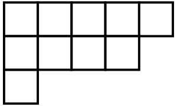
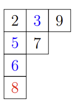

> author: [lyn](https://www.luogu.com.cn/user/1434311)

## 引入

杨氏矩阵(Young tableau)，又名杨表，是一种常用于表示论和舒伯特演算中的组合对象。

杨表是一种特殊的矩阵。它便于对称群和一般线性群的群表示和性质研究。

杨表由剑桥大学数学家阿尔弗雷德·杨（Alfred Young）于 1900 年首次提出，于 1903 年被德国数学家弗罗贝尼乌斯（Ferdinand Georg Frobenius）应用于对称群的研究。

## 定义

??? note "超级长的定义"
    **杨图**
    
    **杨图**（Young diagram，使用点表示时又称 [Ferrers 图](https://en.wikipedia.org/wiki/Partition_%28number_theory%29#Ferrers_diagram)，在 分拆数 一节中有相关介绍）是一个有限的框或单元格集合，左对齐排列，行长按非递增顺序排列。如果把杨图每行的方格数列出，我们得到了一个非负整数 $n$（总方格数）的 **整数分拆**(integer partition)$\lambda$。因此，我们可以将杨图的形状看作 $\lambda$，因为它携带与其整数拆分相同的信息。
    
    杨图之间的包含关系定义了整数分拆上的一个 偏序 关系，此关系拥有 格 的结构，被称为 **杨格**(Young's lattice)。如果把杨图各列的方格数列出，则会得到整数分拆 $\lambda$ 的「共轭分拆」，或「转置分拆」，它所对应到的杨图可由原本的杨图沿主对角线作镜射对称而得。
    
    杨图每个方格的位置由分别代表 **行数** 与 **列数** 的两个座标点决定。列的顺序由左向右，行的顺序则按方格数的由多向少的方向。此处需要注意，根据习惯不同存在着两种不同的杨图画法：第一个将方格数较少的行排在方格数较多的行的下方，第二种画法将各行由大到小一层一层往上叠。由于前一种画法主要由英语国家使用，而后者通常被法语国家使用，习惯上我们分别称它们为英式画法和法式画法。
    
    以下表格中分别为整数分拆 $(5,4,1)$ 对应的杨图不同画法：
    
    -   英式画法：
    -   法式画法：

    **杨表**（Young tableau）是通过用取自某个字母表的符号填充杨氏图的框来获得的，这通常需要是一个全序集和。填入的元素写作 $x_{1}$,$x_{2}$,$x_{3}$,$\ldots$。但为了方便起见，都直接填入正整数。
    
    杨表最初应用于对称群的表示理论时，允许在杨图的 $n$ 的方格中任意填入 $1$ 到 $n$ 中相异的正整数。但现在的研究大多使用「标准」的杨表，即上述条件中各行与各列中方格的数字皆为严格递增的。由 $n$ 个方格的相异杨表数个数形成 [对和数](https://en.wikipedia.org/wiki/Telephone_number_%28mathematiics%29)：
    
    ???+ note "注释"
        **对和数**（involution number/telephone number）是在数学中是一个整数序列，用来计算 $n$ 条电话线中每条线路最多可以连接到另一条线路时可以相互连接的方法个数。它还可以用来描述完全图 $n$ 个顶点上的匹配数，$n$ 个对合元素的排列数，Hermite 多项式系数的绝对值之和，含有 $n$ 个格子的标准杨表的个数，以及不可约对称群的度数之和。
    
    $1, 1, 2, 4, 10, 26, 76, 232, 764, 2620, 9496, \ldots$（[OEIS](https://en.wikipedia.org/wiki/On-Line_Encyclopedia_of_Integer_Sequences) 中的数列 [A000085](https://oeis.org/A000085)）
    
    在其他应用中，杨图也可以被填入相同的数字。若填法的同列数字严格递增，且同行数字单调递增，则该杨表被称为是 **半标准的**（Semistandard Young Tableaux, 有时称为列严格）。杨表中个数字出现的次数记录下来得到的序列被视为杨表的 **权重**。因此，标准杨表的权重必然是 $(1,1,\ldots,1)$。因为在标准杨表中，$1$ 到 $n$ 的每个正整数恰好各出现一次。
     
    **变体**
    
    非完全严格标准的杨表有许多变体（Variations）。例如行严格杨表要求同行数字严格递增，且同列数字单调递增，即列严格杨表的共轭。此外，在平面分拆（plane partitions）理论中，习惯上会将上述的定义中的递增改为递减。其他变体例如带状杨表，会先将一些方块打包成群，然后要求各群的方块必须填入相同数字。
    
    **斜杨表**
    
    给定两个杨图 $\lambda = (\lambda{1}, \lambda{2} \ldots)$、$\mu = (\mu{1}, \mu{2},\ldots)$，满足 $\lambda$ 包含 $\mu$，即 $\mu{i} \leq \mu{i}$ 对所有 $i$。定义「斜杨图」$\lambda/\mu$ 为 $\lambda$ 中所有方格减去 $\mu$ 中的所有方格 即 $\lambda$ 差集 $\mu$。在斜杨图的各方格中填入元素就形成了 **斜杨表**(Skew tableaux)。
    
    例如，下图为整数分拆 $(5,4,1)$ 对应的一个标准斜杨表：
    
    
    
    同理，若满足同一列中的数字严格递增，且同一行中的数字单调递增，则该斜杨表被称作 **半标准斜杨表**；若半标准斜杨表满足各方格不重复的填入数字 $1$ 到 $n$（方格总数），则该斜杨表被称作 **标准斜杨表**。注意，由不同的 $\lambda$ 和 $\mu$ 可得到相同的 $\lambda/\mu$。虽然大部分斜杨表的性质都只依赖于取完差集的方格，但是仍然部分运算依赖于 $\lambda$ 和 $\mu$ 的选取。因此，$\lambda/\mu$ 必须被视为包含两个元素信息：$\lambda$ 和 $\mu$。当 $\mu$ 是空分拆（$0$ 的唯一一种分拆）时，斜杨表 $\lambda/\mu$ 就变成杨表 $\lambda$。  

省流版：杨表由一些格子与其内部的数组成，在英式画法下，杨表保证每一行格子数不大于上一行，每一列格子数不大于上一列，且在每一行和每一列格子中的数单调递增

## 应用1

杨表常用于在组合学、表示理论和代数几何中，用各种不同计算杨表个数的方法得到舒尔函数的定义及相关的恒等式。在信息学竞赛中，常有考察杨表勾长公式的题目。

### 勾长

给定一个共有 $n$ 个方格的杨表 $\pi_{\lambda}$，把 $1$ 到 $n$ 的 $n$ 个数字填入杨表中，使得每行从左到右，每列从下到上都是递增的。用 $dim_{\pi_{\lambda}}$ 表示可以这样填的方法个数。

对于杨表中的一个方格 $v$，定义其 **勾长** $\mathrm{hook}(v)$ 等于同行右边的方格数加上同列上面的方格数，再加 1（即方格本身）。

### 勾长公式

如果用 $dim_{\lambda}$ 表示这样的方法个数，**勾长公式** 就是方法个数等于 $n!$ 除以所有方格的勾长的乘积。

$$
\dim \pi _{\lambda}={\frac {n!}{\prod_{{x\in Y(\lambda)}}{\mathrm {hook}}(x)}}.
$$

数学家迪普西科给出了如下证明
??? note "证明"
    杨氏矩阵的勾长公式可以通过数学归纳法并结合勾长乘积的性质来证明。具体步骤如下：

    - **基础情形**：当 $n=1$ 时，杨表只有一个方格，勾长为 $1$ ，公式显然成立。

    - **归纳假设**：假设对于所有大小小于 $n$ 的杨图，勾长公式成立。

    - **归纳步骤**：考虑大小为 $n$ 的杨图 $λ$ ，其勾长乘积为 $H(λ)$ 。对于每个角方格 $c$ ，去掉 $c$ 得到杨图 $μ_c$ ，其勾长乘积为 $H(μ_c)$ 。根据归纳假设， $μ_c$ 对应的标准杨表数目为$\frac{(n-1)!}{H(μ_c)}$。

    - **递推关系**：标准杨表数目f^λ等于所有可能去掉角方格后的杨表数目之和，即：
    
    $$
    f^λ = \sum_{c} f^{μ_c}
    $$
    
    代入归纳假设得：
    
    $$
    \frac{n!}{H(λ)} = \sum_{c} \frac{(n-1)!}{H(μ_c)}
    $$
    
    两边同除以$(n-1)!$得：
    
    $$
    \frac{n}{H(λ)} = \sum_{c} \frac{1}{H(μ_c)}
    $$
    

    - **勾长乘积关系**：通过分析去掉角方格$c$后，剩余方格的勾长变化，可得：
    
    $$
    \frac{1}{H(μ_c)} = \frac{hook(c)}{H(λ)} \prod_{(i,j) \in 第r行或第s列} \frac{hook_λ(i,j)}{hook_λ(i,j)-1}
    $$
    
    其中$hook(c)=1$，且通过组合恒等式验证：
    
    $$
    \sum_{c} \prod_{(i,j) \in 第r行或第s列} \frac{hook_λ(i,j)}{hook_λ(i,j)-1} = n
    $$
    

    - **结论**：由此完成归纳步骤，证明勾长公式成立。

    最终，杨氏矩阵的勾长公式得证：

    $$f^\lambda = \frac{n!}{\prod_{(i,j) \in \lambda} \text{hook}(i,j)}$$


每个格子中的数代表了该格子的勾长。

所以对于整数分拆 $10 = 5 + 4 + 1$ 的杨表，如上图所示。有

$$
\dim \pi _{\lambda }={\frac  {10!}{7\cdot 5\cdot 4\cdot 3\cdot 1\cdot 5\cdot 3\cdot 2\cdot 1\cdot 1}}=288.
$$


种方法。

### 例题

???+ question "[P4484 [BJWC2018] 最长上升子序列](https://www.luogu.com.cn/problem/P4484)"
    现在有一个长度为 $n$ 的随机排列，求它的最长上升子序列长度的期望。

    为了避免精度误差，你只需要输出答案模 $998244353$ 的余数。

    对于 $100 \%$ 的数据，$1 \le n \le 28$。

    共有 25 组数据，对于第 $i$ 组数据（$1 \le i \le 25$），$n = i + 3$。

??? tip "解题思路"
    对于 $n$ 个格子的杨表，分别统计每种形状有多少种填法，最后除以 $n!$ 即可。

??? code "实现"
    ```cpp
    --8<-- "docs/Math/Combine/code/Luogu_P_4484.cpp"
    ```


## 应用2

杨表的插入算法可以帮助我们在较短时间内构造出一个序列对应的杨表。

### 标准杨表的插入算法
    
排列的性质可以由杨表直观地表现出来。**RSK 插入算法** 就提供了一个将杨表和排列联系起来的途径。它由 Robinson, Schensted 和 Knuth 提出。

令 $S$ 是一个杨表，定义 $S \leftarrow x$ 表示将 $x$ 从第一行插入杨表中，具体如下：

1.  在当前行中找到最小的比 $x$ 大的数 $y$。
2.  如果找到了，用 $x$ 去替换 $y$，移到下一行，令 $x \leftarrow y$ 重复操作 1。
3.  如果找不到，就把 $x$ 放在该行末尾并退出。记 $x$ 在第 $s$ 行第 $t$ 列，$(s, t)$ 必定是一个边角。一个格子 $(s, t)$ 是边角当且仅当 $(s + 1, t)$ 和 $(s, t + 1)$ 都不存在格子。

例如，将 $3$ 插入杨表 $(2, 5, 9)(6, 7)(8)$ 的步骤为：



对于杨表 $P$, 定义对于一个从 $1$ 到 $n$ 的排列 $X = x_{1}, \ldots , x_{n}$。

1.  $P_{X}$ 中第一行的长度即为排列 $X$ 的 **最长上升子序列（LIS）** 长度。注意，$P$ 的第一行并不一定是 LIS 本身，所以不能直接利用杨表性质解决「LIS 划分」之类的问题。

2.  对于一个排列 $X$ 和它产生的杨表 $P_{X}$，若 $X^R$ 是 $X$ 的翻转，那么 $X^R$ 产生的杨表 $P_{X^R}$ 即为 $P_{X}$ 交换行列得到。

    例如，对于排列 $X = 1, 5, 7, 2, 8, 6, 3, 4$ 和 $X^R = 4, 3, 6, 8, 2, 7, 5, 1$, 我们可得到如下杨表 $P_{X}$:

    

3.  杨表 $P_{X}$ 中的第一列长度即为排列 $X$ 的 **最长下降子序列（LDS）** 长度。
4.  定义长度不超过 $k$ 的 $LIS/LDS$ 长度为 $k-LIS$ 和 $k-LDS$, 此类问题我们同样可以用杨表来解决。对于 $1-LIS$，显而易见最长的 $1-LIS$ 子序列就是该序列的 $LDS$，这也正是杨表的第一列；同样可得，杨表前 $k$ 列的长度就是最长的 $k-LIS$ 子序列的长度。证明如下：

???+ note "证明"
    对于一个排列 $X$ 和它的 $m$ 行杨表 $P$，令排列 $X^∗$ 为 $(P_{m,1}\ldots,P_{m,λ_{m}},P_{m−1,1}\ldots,P_{1,1}\ldots P_{1,λ_{1}})$（即将杨表从下往上每行依次写在后面）。那么 $X$ 一定可以通过交换操作转化成 $X^*$。

### 例题
???+ question "[P3774 [CTSC2017] 最长上升子序列](https://www.luogu.com.cn/problem/P3774)"
    有一个长为 $n$ 的数列 $b$。对于序列 $B_{m} = (b_{1}, b_{2},\ldots, b_{m})$，设 $C$ 是 $B_{m}$ 的子序列，且 $C$ 的最长上升子序列的长度不超过 $k$，询问 $C$ 的长度最大值。

??? tip "解题思路"
    按照上面的性质，每个询问的答案即为原序列前 $m$ 项对应的杨表中前 $k$ 列长度之和。

    我们将所有询问离线，按照 $m$ 动态建立杨表并维护前 $k$ 列长度之和。

    但本题不能直接维护整个杨表，不然空间不够。

    注意到杨氏矩阵逐行列数不增，以及逐列行数不增的性质，那么假设一个数最终插入到 $(x,y)$ 的位置，$x$ , $y$  中至少有一者 $≤$ $\sqrt n$。

    所以一个更为聪明的算法呼之欲出，我们改为维护运算符取反后 $P_B^′$ 的前 $\sqrt n$ 行，以及 $P_B$ 的前 $\sqrt n$ 行。

    前者由 $P_B$ 形状上转置得到，因此对应长度就是 $P_B$ 前 $n$ 列的长度；而后者在求大于 $n$ 的列长度时必然完整。

    单次插入是单点修改，可以用树状数组实现。

??? code "实现"
    ```cpp
    --8<-- "docs/Math/Combine/code/Luogu_P_3774.cpp"
    ```