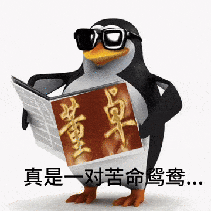

> 本文由 [ShanLing](https://www.luogu.com.cn/user/566353) 提供。

其实，wjq、lyn的关系塑造非常复杂细腻。肉体上wjq是攻扮演男人，lyn是受扮演女人，但是在感情上lyn是学业心大过竞赛，而wjq只在乎竞赛，只想要两人厮守，在感情上lyn才是男人而wjq变成了女人。这种肉体感情上的错位才是他俩决裂的根本，wjq把自己全部的模拟题都给了lyn，lyn却没有没有回报自己全部的爱，这才让wjq产生恨意，可是当lyn真的退竞后，wjq也失去了能让他全身心去教的人。当lyn走时将退竞申请书放在wjq桌上时，wjq想的是什么呢？是那一夜的看片，还是看到lyn忘去那一夜情，与zgd好上了的时候的愤怒与惆怅?wjq给了他所有的题，甚至希望将所有的精力投入到这段荒唐的竞赛，可lyn追求的却不是竞赛，相反，他的一句“男儿要学业有成，步入高堂。”彻底浇灭了他心中残存的火花。wjq恨他，但那一夜看片却历历在目。他知道，他要亲手赶走他的义父，亲手赶走自己妄想与他长相厮守一辈子的人。所以lyn走后，他哭。他忘不了一夜看片，忘不了在关门前收下lyn的申请书，望到lyn绝妙的码风时萌生的情感。在结尾，wjq拿着模拟题独自向高一竞赛教室奔去，如果可以，他多么愿意lyn与他一起，欢笑着走向高一竞赛教室。所以啊，他们不过又是一对苦命鸳鸯罢了。

