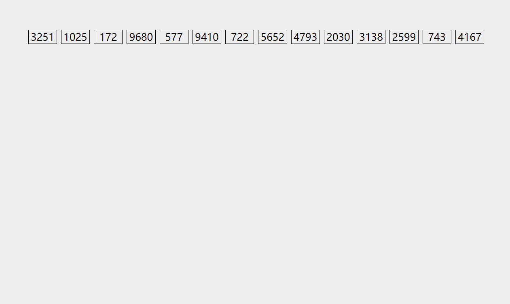

> author: [C0C](https://www.cnblogs.com/C0Cnotes/articles/18850309)

## 后缀数组维护的内容

后缀数组主要维护的数组有

+ $sa[i]$：将字符串所有后缀按照字典序排序后第 $i$ 小后缀的编号。
+ $rk[i]$：编号为 $i$ 的后缀是第几小。
+ $height[i]$：第 $i$ 名的后缀与它前一名的后缀的最长公共前缀。

## 后缀数组的求法

### $O(n^2\log n)$做法

直接 `sort()`。

### $O(n\log^2n)$做法

我们结合倍增的思想。

下标从 $1$ 开始的字符串 $s$ 中以下标 $i$ 为起始的后缀标号为 $i$。

+ 以 $s[i]$ 为后缀 $i$ 的关键字进行排序得到第一次的 $sa_1$ 和 $rk_1$ 数组，即长度为 $1$ 的字串排序。
+ 以 $rk_1[i],rk_1[i + 1]$ 为后缀 $i$ 的关键字进行排序，得到第二次的 $sa_2$ 和 $rk_2$ 数组，即长度为 $2$ 的字串排序，特别地，若 $i > n$，$rk_1[i] = 0$。
+ 以 $rk_2[i],rk_2[i + 2]$ 为后缀 $i$ 的关键字进行排序，得到第三次的 $sa_4$ 和 $rk_4$ 数组，即长度为 $4$ 的字串排序。
+ 以此类推进行倍增，直到排出长度为 $n$ 的字串的排序，得到的 $sa$ 和 $rk$ 即为最终结果。


倍增复杂度为 $O(\log n)$，加上 `sort()` 最终复杂度为 $O(n\log^2n)$。

### $O(n\log n)$做法

我们发现，在排序的过程中关键字值域为 $[1,n]$，且为双关键字排序，我们可以用基数排序思想将复杂度优化为 $O(n\log n)$。

基数排序原理如下



其复杂度为 $O(nm \log r)$，其中 $r$ 为所采取的基数，而 $m$ 为堆数。

### $O(n)$做法

不常用

[诱导排序与 SA-IS 算法](https://riteme.site/blog/2016-6-19/sais.html)

## height 数组

### LCP（最长公共前缀）

两个字符串 $S$ 和 $T$ 的 LCP 就是最大的 $x$($x\le \min(|S|, |T|)$) 使得 $S_i=T_i\ (\forall\ 1\le i\le x)$。

下文中以 $lcp(i,j)$ 表示后缀 $i$ 和后缀 $j$ 的最长公共前缀（的长度）。

### height 数组的定义

$height[i]=lcp(sa[i],sa[i-1])$，即第 $i$ 名的后缀与它前一名的后缀的最长公共前缀。

$height[1]$ 可以视作 $0$。

### $O(n)$ 求 height 数组需要的一个引理

$height[rk[i]]\ge height[rk[i-1]]-1$

当 $height[rk[i-1]]\le1$ 时，上式显然成立（右边小于等于 $0$）。

当 $height[rk[i-1]]>1$ 时：

根据 $height$ 定义，有 $lcp(sa[rk[i-1]], sa[rk[i-1]-1]) = height[rk[i-1]] > 1$。

既然后缀 $i-1$ 和后缀 $sa[rk[i-1]-1]$ 有长度为 $height[rk[i-1]]$ 的最长公共前缀，

那么不妨用 $aA$ 来表示这个最长公共前缀。（其中 $a$ 是一个字符，$A$ 是长度为 $height[rk[i-1]]-1$ 的字符串，非空）

那么后缀 $i-1$ 可以表示为 $aAD$，后缀 $sa[rk[i-1]-1]$ 可以表示为 $aAB$。（$B < D$，$B$ 可能为空串，$D$ 非空）

进一步地，后缀 $i$ 可以表示为 $AD$，存在后缀（$sa[rk[i-1]-1]+1$）$AB$。

因为后缀 $sa[rk[i]-1]$ 在大小关系的排名上仅比后缀 $sa[rk[i]]$ 也就是后缀 $i$，小一位，而 $AB < AD$。

所以 $AB \leqslant$ 后缀 $sa[rk[i]-1] < AD$，显然后缀 $i$ 和后缀 $sa[rk[i]-1]$ 有公共前缀 $A$。

于是就可以得出 $lcp(i,sa[rk[i]-1])$ 至少是 $height[rk[i-1]]-1$，也即 $height[rk[i]]\ge height[rk[i-1]]-1$。

### $O(n)$ 求 height 数组的代码实现

利用上面这个引理暴力求即可：

???+ code "实现"
    ```cpp
    for (i = 1, k = 0; i <= n; i++)
    {
        if (rk[i] == 0) continue;
        if (k) k--;
        while (s[i + k] == s[sa[rk[i] - 1] + k]) k++;
        height[rk[i]] = k;
    }
    ```

$k$ 不会超过 $n$，最多减 $n$ 次，所以最多加 $2n$ 次，总复杂度就是 $O(n)$。

### height 数组用途

+ **两子串最长公共前缀**

    $lcp(sa[i],sa[j]) = \min \{height[i+1..j]\}$

    感性理解：如果 $height$ 一直大于某个数，前这么多位就一直没变过；反之，由于后缀已经排好序了，不可能变了之后变回来。

    严格证明可以参考[\[2004\] 后缀数组 by. 许智磊][1]。

    有了这个定理，求两子串最长公共前缀就转化为了 RMQ 问题。

+ **比较一个字符串的两个子串的大小关系**

    假设需要比较的是 $A=S[a..b]$ 和 $B=S[c..d]$ 的大小关系。

    若 $lcp(a, c)\ge\min(|A|, |B|)$，$A<B\iff |A|<|B|$。

    否则，$A<B\iff rk[a]< rk[c]$。

+ **不同子串的数目**

    子串就是后缀的前缀，所以可以枚举每个后缀，计算前缀总数，再减掉重复。

    「前缀总数」其实就是子串个数，为 $n(n+1)/2$。

    如果按后缀排序的顺序枚举后缀，每次新增的子串就是除了与上一个后缀的 LCP 剩下的前缀。这些前缀一定是新增的，否则会破坏 $lcp(sa[i],sa[j])=\min\{height[i+1..j]\}$ 的性质。只有这些前缀是新增的，因为 LCP 部分在枚举上一个前缀时计算过了。

    所以答案为：

    $\frac{n(n+1)}{2}-\sum\limits_{i=2}^nheight[i]$

+ **出现至少 $k$ 次的子串的最大长度**

    例题：[P2852 [USACO06DEC] Milk Patterns](https://www.luogu.com.cn/problem/P2852)。

    出现至少 $k$ 次意味着后缀排序后有至少连续 $k$ 个后缀以这个子串作为公共前缀。

    所以，求出每相邻 $k-1$ 个 $height$ 的最小值，再求这些最小值的最大值就是答案。

    可以使用单调队列 $O(n)$ 解决，但使用其它方式也足以 AC。

+ **是否有某字符串在文本串中至少不重叠地出现了两次**

    可以二分目标串的长度 $|s|$，将 $h$ 数组划分成若干个连续 LCP 大于等于 $|s|$ 的段，利用 RMQ 对每个段求其中出现的数中最大和最小的下标，若这两个下标的距离满足条件，则一定有长度为 $|s|$ 的字符串不重叠地出现了两次。

+ **连续的若干个相同子串**

    我们可以枚举连续串的长度 $|s|$，按照 $|s|$ 对整个串进行分块，对相邻两块的块首进行 LCP 与 LCS 查询，具体可见[\[2009\] 后缀数组——处理字符串的有力工具][2]。

    例题：[P1117 [NOI2016] 优秀的拆分](https://www.luogu.com.cn/problem/P1117)。

+ **结合并查集**

    某些题目求解时要求你将后缀数组划分成若干个连续 LCP 长度大于等于某一值的段，亦即将 $h$ 数组划分成若干个连续最小值大于等于某一值的段并统计每一段的答案。如果有多次询问，我们可以将询问离线。观察到当给定值单调递减的时候，满足条件的区间个数总是越来越少，而新区间都是两个或多个原区间相连所得，且新区间中不包含在原区间内的部分的 $h$ 值都为减少到的这个值。我们只需要维护一个并查集，每次合并相邻的两个区间，并维护统计信息即可。

    例题：[P2178 [NOI2015] 品酒大会](https://www.luogu.com.cn/problem/P2178)

+ **结合线段树**

    某些题目让你求满足条件的前若干个数，而这些数又在后缀排序中的一个区间内。这时我们可以用归并排序的性质来合并两个结点的信息，利用线段树维护和查询区间答案。

## 实现

???+ code "[P3809 【模板】后缀排序](https://www.luogu.com.cn/problem/P3809)"
    ```cpp
    --8<-- "docs/String/code/P3809.cpp"
    ```

## 习题

[P4051 [JSOI2007] 字符加密](https://www.luogu.com.cn/problem/P4051)

[P2852 [USACO06DEC] Milk Patterns](https://www.luogu.com.cn/problem/P2852)

[P1117 [NOI2016] 优秀的拆分](https://www.luogu.com.cn/problem/P1117)

[P2178 [NOI2015] 品酒大会](https://www.luogu.com.cn/problem/P2178)