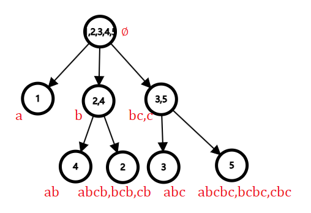

> author: [C0C](https://www.cnblogs.com/C0Cnotes/articles/18868716)

## 自动机

导航至 [OI-wiki 自动机](https://oi-wiki.org/string/automaton/)。

自动机是一个对信号序列进行判定的数学模型，其结构就是一张有向图（DAG）。

自动机的工作方式和流程图类似，不同的是：自动机的每一个结点都是一个判定结点；自动机的结点只是一个单纯的状态而非任务；自动机的边可以接受多种字符（不局限于 T 或 F）。

需要注意的是，自动机只是一个 数学模型，而 不是算法，也 不是数据结构。实现同一个自动机的方法有很多种，可能会有不一样的时空复杂度。

形式化地，一个 **确定有限状态自动机（DFA）** 由以下五部分构成：

1. **字符集**（$\Sigma$），该自动机只能输入这些字符。
2. **状态集合**（$Q$）。如果把一个 DFA 看成一张有向图，那么 DFA 中的状态就相当于图上的顶点。
3. **起始状态**（$start$），$start\in Q$，是一个特殊的状态。起始状态一般用 $s$ 表示，为了避免混淆，本文中使用 $start$。
4. **接受状态集合**（$F$），$F\subseteq Q$，是一组特殊的状态。
5. **转移函数**（$\delta$），$\delta$ 是一个接受两个参数返回一个值的函数，其中第一个参数和返回值都是一个状态，第二个参数是字符集中的一个字符。如果把一个 DFA 看成一张有向图，那么 DFA 中的转移函数就相当于顶点间的边，而每条边上都有一个字符。

DFA 的作用就是识别字符串，一个自动机 $A$，若它能识别（接受）字符串 $S$，那么 $A(S)=\mathrm{True}$，否则 $A(S)=\mathrm{False}$。

当一个 DFA 读入一个字符串时，从初始状态起按照转移函数一个一个字符地转移。如果读入完一个字符串的所有字符后位于一个接受状态，那么我们称这个 DFA **接受** 这个字符串，反之我们称这个 DFA **不接受** 这个字符串。

如果一个状态 $v$ 没有字符 $c$ 的转移，那么我们令 $\delta(v,c)=\mathrm{null}$，而 $\mathrm{null}$ 只能转移到 $\mathrm{null}$，且 $\mathrm{null}$ 不属于接受状态集合。无法转移到任何一个接受状态的状态都可以视作 $\mathrm{null}$，或者说，$\mathrm{null}$ 代指所有无法转移到任何一个接受状态的状态。

我们扩展定义转移函数 $\delta$，令其第二个参数可以接收一个字符串：$\delta(v,s)=\delta(\delta(v,s[1]),s[2..|s|])$，扩展后的转移函数就可以表示从一个状态起接收一个字符串后转移到的状态。那么，$A(s)=[\delta(start,s)\in F]$。

OI 中常用的自动机：字典树，KMP 自动机，AC 自动机，后缀自动机，广义后缀自动机，回文自动机，序列自动机，后缀链接

## 后缀自动机

后缀自动机（Suffix Automaton,SAM）是能存储和识别一个字符串 $S$ 的所有后缀的自动机。

后缀自动机也是一个 DAG。根据自动机的定义，将每个节点看做一个状态，节点之间的有向边是状态的转移，每条边上有一个字符表示转移值。

后缀自动机最巧妙的地方就是**用路径表示子串**。

### endpos 和等价类

**endpos** 即“右端点结束位置”。它可以有效地处理子串之间的包含关系。

观察一个字符串$\texttt{abcbc}$。

| 子串$T$ |   a   |   b   |   c   |  ab   |  bc   |  cb   |  abc  |  bcb  |  cbc  | abcb  | bcbc  | abcbc |
| :-----: | :---: | :---: | :---: | :---: | :---: | :---: | :---: | :---: | :---: | :---: | :---: | :---: |
| endpos  |   1   |  2,4  |  3,5  |   2   |  3,5  |   4   |   3   |   4   |   5   |   4   |   5   |   5   |

我们将字串按 endpos 分组和排序，令 $\varnothing$ 的 endpos = $\{1,2,3,4,5\}$。

| 子串$T$ | $\varnothing$ |   a   |  ab   |   b   |  abc  | bc,c  | abcb,bcb,cb | abcbc,bcbc,cbc |
| :-----: | :-----------: | :---: | :---: | :---: | :---: | :---: | :---------: | :------------: |
| endpos  |   1,2,3,4,5   |   1   |   2   |  2,4  |   3   |  3,5  |      4      |       5        |

于是得到 7 组 endpos 不同的子串组合（不包括 $\varnothing$），我们称这每一组为一种**等价类**。

下面我们用 $endpos(s)$ 表示字符串 $s$ 的 endpos 集合。

### parent tree 母树

考虑任意一个子串 $t$，我们在其前面增加一个字符则其变成一个新的子串 $\texttt{'c' + t}$，那么 $endpos(\texttt{'c' + t}) \subseteq endpos(t)$。于是我们以空集为根，可以建出一颗树，其中每个节点代表一个等价类，若 $endpos(u) \subseteq endpos(v)$ 就有一条从 $u$ 指向 $v$ 的边，这个这颗树我们就称之为 parent tree，也叫母树。

下面是对于字符串 $\texttt{abcbc}$ 建立的parent tree。



### 后缀链

建立一个 SAM 需要一个关键技术——**后缀链**

一个节点（状态）$v$ 的后缀链指向上层的一个节点 $u$（记为 $fa_v$），节点 $u$ 中的最长的子串长度应为节点 $v$ 中最短的长度 $-1$。

后缀链的作用是把两个不同节点的**连续**子串连接起来，因此每个节点都有且仅有一个后缀链指向某个上层节点。沿着后缀链向上走，对应的后缀长度会连续变短，最终到达根节点。

于是我们发现，对于 parent tree 的任意节点 $u$，其后缀链指向的节点 $fa_u$ 即为 parent tree 中指向 $u$ 的节点。因此，parent tree 上一条从根出发都某个节点的路径，表达了一个完整的后缀组合，而这就是 parent tree 的本质。

### 一些引理

??? note "引理 1：对于一个字符串中的两个子串 $u$,$v$，若 $endpos(u) = endpos(v)$，那么一个将是另一个的后缀"

    因为若 $v$ 不是 $u$ 的后缀，那么必定有一个 $v$ 的最后一位字符就必然不等于 $u$ 的最后一位字符。

??? note "引理 2：对于一个字符串的子串 $u$,$v(|u|≥|v|)$，那么必然有 $endpos(u) \subseteq endpos(v)$ 或 $endpos(u) ∩ endpos(v)=\varnothing$"

    显然。

??? note "引理 3: 每个 endpos 等价类里的子串升序排序后长度连续，且前一个串是这个串的后缀。"

    若字符串 $u$，$v$ 在同一个 endpos 等价类里，且 $u$ 的长度严格小于 $v$ 的长度且 $u$，$v$ 长度不连续。由引理 1 显然 $u$ 是 $v$ 的后缀，那么 $u$，$v$ 中间的那部分子串减去某个前缀后加上 $u$ 显然亦为同一个 endpos 等价类里。

??? note "引理 4：若两个等价类 $P$，$Q$，$P$ 在 parent tree 上是 $Q$ 的父亲，那么 $P$ 的最长子串的长度 $+1$，等于 $Q$ 的最短子串的长度。"

    我们考虑在一个等价类中的某个子串前再添加一个字符，显然，若选择的子串是这个等价类中的最长子串，形成的字符串就归于其儿子的等价类中，否则就仍在这个等价类中。

    如果选择的是最长子串，那这个新形成的字符串肯定这个儿子等价类 中最短的一个。

### 后缀自动机的构建

我们采用**增量法**建 SAM，即依次加入字符串 $S$ 每个字符，在加入一个字符时增加 SAM 的节点，直到所有字符都加入 SAM。SAM 以路径表示子串，我们要时刻保证 SAM 的性质，有以下几个要素需要牢记：

1.  从根到达图中任意点的路径形成的字符串是 $S$ 的一个子串。
2.  起点和终点之间的有向边代表在起点表示的字符串后增加一个字符。
3.  保证以每个点为终点的子串属于同一个等价类。
4.  点之间需要符合 parent tree 的父子关系，即到达点 $u$ 的所有字符串的长度都必须大于到达 $fa_u$ 的所有字符串的长度，到达 $fa_u$ 的任意子串必须为到达 $u$ 的任意子串的后缀。

以下是 $S = \texttt{abcbc}$ 的后缀自动机的构建流程。


我们定义 $last$ 表示目前最后加入自动机的字符指向的节点。

1. 建立一个 $0$ 号节点即根，目前 SAM 仅能表示空串。$last = 0$。
2. 加入一个字符 $\texttt{a}$，最长路径变为 $\texttt{a}$。新增一个节点 $1$，连一条边，由 $0$ 指向 $1$。$fa_1 = 0$。$last = 1$。
3. 加入一个字符 $\texttt{b}$，最长路径变为 $\texttt{ab}$。新增一个节点 $2$，连一条边，由 $1$ 指向 $2$。注意到 $\texttt{b}$ 是一个未出现过的字符，会产生以 $\texttt{b}$ 为开头的子串，因此需要再连一条边，由 $0$ 指向 $2$。节点 $2$ 可以表示后缀 $\texttt{ab}$、$\texttt{b}$ ，于是 $fa_2 = 0$。$last = 2$。
    那么实际在代码中，“注意到 $\texttt{b}$ 是一个未出现过的字符”的方法就是利用后缀链。从 $last$ 开始顺着后缀链向上逐个查找以前存在的可能指向新节点的点（跳 $fa$），如果发现没有，那么就指向新节点，一直到发现为止。其具体操作在下面代码中讲解。

4. 加入一个字符 $\texttt{c}$，最长路径变为 $\texttt{abc}$。新增一个节点 $3$，连两条边，分别由 $2$ 指向 $3$ 和由 $0$ 指向 $3$。$fa_3 = 0$。$last = 3$。
5. 加入一个字符 $\texttt{b}$，最长路径变为 $\texttt{abcb}$。新增一个节点 4，连一条边，由 $3$ 指向 $4$。发现曾经存在以 $\texttt{b}$ 为结尾的点（节点 $2$），我们的操作是将 $2$ 复制一次，变成两个点即节点 $2$ 和 $5$。断开 $0 \rightarrow 2$，连 $0 \rightarrow 5$，$5 \rightarrow 3$（实际上在连 $0 \rightarrow 5$ 时也会将 $0 \rightarrow 2$ 断开）。那么此时问题就是节点 $2$、$4$ 和 $5$ 的后缀链应指向哪里。$5$ 表示 $\texttt{b}$，因此 $fa_5 = 0$；$2$ 表示 $\texttt{ab}$，4 表示 $\texttt{abcb}$、$\texttt{bcb}$、$\texttt{cb}$，前一个后缀都是 $\texttt{c}$，因此 $fa_2 = fa_4 = 5$。$last = 4$。
6. 加入一个字符 $\texttt{c}$，以同样的方式进行操作，可以得到最终字符串的 SAM。

形式化的说，添加一个字符 $c$ 就是如下的过程：

-   令 $\textit{last}$ 为添加字符 $c$ 之前，整个字符串对应的状态（一开始我们设 $\textit{last}=0$，算法的最后一步更新 $\textit{last}$）。
-   创建一个新的状态 $\textit{np}$，并将 $\operatorname{len}(\textit{np})$ 赋值为 $\operatorname{len}(\textit{last})+1$，在这时 $\operatorname{fa}(\textit{np})$ 的值还未知。
-   现在我们按以下流程进行（从状态 $\textit{last}$ 开始）。如果还没有到字符 $c$ 的转移，我们就添加一个到状态 $\textit{np}$ 的转移，遍历后缀链接。如果在某个点已经存在到字符 $c$ 的转移，我们就停下来，并将这个状态标记为 $p$。
-   如果没有找到这样的状态 $p$，我们就到达了虚拟状态 $-1$，我们将 $\operatorname{fa}(\textit{np})$ 赋值为 $0$ 并退出。
-   假设现在我们找到了一个状态 $p$，其可以通过字符 $c$ 转移。我们将转移到的状态标记为 $q$。
-   现在我们分类讨论两种状态，要么 $\operatorname{len}(p) + 1 = \operatorname{len}(q)$，要么不是。
-   如果 $\operatorname{len}(p)+1=\operatorname{len}(q)$，我们只要将 $\operatorname{fa}(\textit{np})$ 赋值为 $q$ 并退出。
-   否则就会有些复杂。需要 **复制** 状态 $q$：我们创建一个新的状态 $\textit{nq}$，复制 $q$ 的除了 $\operatorname{len}$ 的值以外的所有信息（后缀链接和转移）。我们将 $\operatorname{len}(\textit{nq})$ 赋值为 $\operatorname{len}(p)+1$。
    复制之后，我们将后缀链接从 $\textit{np}$ 指向 $\textit{nq}$，也从 $q$ 指向 $\textit{nq}$。
    最终我们需要使用后缀链接从状态 $p$ 往回走，只要存在一条通过 $p$ 到状态 $q$ 的转移，就将该转移重定向到状态 $\textit{nq}$。
-   以上三种情况，在完成这个过程之后，我们将 $\textit{last}$ 的值更新为状态 $\textit{np}$。

### 代码实现构建后缀自动机

下面分别用两种不同的写法实现了 SAM，作为参考。

??? code "实现一"
    ```cpp
    --8<-- "docs/String/code/SAM.cpp"
    ```

为了方便与别的算法结合，实现二以 $t_0 = 1$ 作为根，其后缀链接指向 $0$。

??? code "实现二"
    ```cpp
    --8<-- "docs/String/code/SAM2.cpp"
    ```

### 后缀自动机的一些性质

#### 时间复杂度

很明显，每次 `insert()` 操作除跳 $fa$ 以外的操作均为常数复杂度。

而跳 $fa$ 操作中 `while(p != -1 && !sam[p].son[c])` 和 `while(p != -1 && sam[p].son[c] == q)` 的跳出条件都较易达到，所以也可以认为是常数复杂度。

实际上，后缀自动机的渐进复杂度是 $O(n\log |\Sigma|)$ ，其中 $|\Sigma|$ 为字符集。

具体证明摘自 OI-Wiki。

??? tip "证明"
    首先我们假设字符集大小为 **常数**。如果字符集大小不是常数，SAM 的时间复杂度就不是线性的。从一个结点出发的转移存储在支持快速查询和插入的平衡树中。因此如果我们记 $\Sigma$ 为字符集，$\left|\Sigma\right|$ 为字符集大小，则算法的渐进时间复杂度为 $O(n\log\left|\Sigma\right|)$，空间复杂度为 $O(n)$。然而如果字符集足够小，可以不写平衡树，以空间换时间将每个结点的转移存储为长度为 $\left|\Sigma\right|$ 的数组（用于快速查询）和链表（用于快速遍历所有可用关键字）。这样算法的时间复杂度为 $O(n)$，空间复杂度为 $O(n\left|\Sigma\right|)$。

    所以我们将认为字符集的大小为常数，即每次对一个字符搜索转移、添加转移、查找下一个转移。这些操作的时间复杂度都为 $O(1)$。

    如果我们考虑算法的各个部分，算法中有三处时间复杂度不明显是线性的：

    -   第一处是遍历所有状态 $\textit{last}$ 的后缀链接，添加字符 $c$ 的转移。
    -   第二处是当状态 $q$ 被复制到一个新的状态 $\textit{nq}$ 时复制转移的过程。
    -   第三处是修改指向 $q$ 的转移，将它们重定向到 $\textit{nq}$ 的过程。

    我们使用 SAM 的大小（状态数和转移数）为 **线性的** 的事实（对状态数是线性的的证明就是算法本身，对转移数为线性的的证明将在稍后实现算法后给出）。

    因此上述 **第一处和第二处** 的总复杂度显然为线性的，因为单次操作均摊只为自动机添加了一个新转移。

    还需为 **第三处** 估计总复杂度，我们将最初指向 $q$ 的转移重定向到 $\textit{nq}$。我们记 $v=\operatorname{longest}(p)$，这是一个字符串 $s$ 的后缀，每次迭代长度都递减——因为字符串 $s$ 的位置每次迭代都单调上升。这种情况下，如果在循环的第一次迭代之前，相对应的字符串 $v$ 在距离 $\textit{last}$ 的深度为 $k$ $(k\ge 2)$ 的位置上（深度记为后缀链接的数量），那么在最后一次迭代后，字符串 $v+c$ 将会成为路径上第二个从 $\textit{np}$ 出发的后缀链接（它将会成为新的 $\textit{last}$ 的值）。

    因此，循环中的每次迭代都会使作为当前字符串的后缀的字符串 $\operatorname{longest}(\operatorname{link}(\operatorname{link}(\textit{last}))$ 的位置单调递增。因此这个循环最多不会执行超过 $n$ 次迭代，这正是我们需要证明的。

#### 节点数

SAM 中的节点数（状态数）不会超过 $2n - 1$。

每次插入操作会加入至多两个节点。

#### 边数

对于一个长度为 $n$ 的字符串 $s$，它的 SAM 中的边数（转移数） **不会超过**  $3n-4$（假设 $n\ge 3$）。

??? tip "证明"
    我们首先估计连续的转移的数量。考虑自动机中从状态 $t_0$ 开始的所有最长路径的生成树。生成树只包含连续的边，因此数量少于状态数，即边数不会超过 $2n-2$。

    现在我们来估计不连续的转移的数量。令当前不连续转移为 $(p,\,q)$，其字符为 $c$。我们取它的对应字符串 $u+c+w$，其中字符串 $u$ 对应于初始状态到 $p$ 的最长路径，$w$ 对应于从 $q$ 到任意终止状态的最长路径。一方面，每个不完整的字符串所对应的形如 $u+c+w$ 的字符串是不同的（因为字符串 $u$ 和 $w$ 仅由完整的转移组成）。另一方面，由终止状态的定义，每个形如 $u+c+w$ 的字符串都是整个字符串 $s$ 的后缀。因为 $s$ 只有 $n$ 个非空后缀，且形如 $u+c+w$ 的字符串都不包含 $s$（因为整个字符串只包含完整的转移），所以非完整的转移的总数不会超过 $n-1$。

    将以上两个估计值相加，我们可以得到上界 $3n-3$。然而，最大的状态数只能在类似于 $\texttt{abbb} \cdots \texttt{bbb}$ 的情况中产生，而此时转移数量显然少于 $3n-3$。

    因此我们可以获得更为紧确的 SAM 的转移数的上界：$3n-4$。字符串 $\texttt{abbb} \cdots \texttt{bbbc}$ 就达到了这个上界。

### 后缀自动机的用途

后缀自动机几乎是“全能”的处理字符串算法，以下为常用的几种用途。

???+ question "检查字符串是否出现"

    给一个文本串 $T$ 和多个模式串 $P$，询问字符串 $P$ 是否作为 $T$ 的一个子串出现。

对于 $T$ 构建 SAM，顺着边遍历 $P$ ，若某个状态无法转移下去那么就停止。

对于每个字符串 $P$，算法的时间复杂度为 $O(|P|)$。此外，这个算法还找到了模式串 $P$ 在文本串中出现的最大前缀长度。

例题：[[JSOI2012] 玄武密码](https://www.luogu.com.cn/problem/P5231)

???+ question "不同子串个数"

    给一个字符串 $S$，计算不同子串的个数。

对字符串 $S$ 构造后缀自动机。

每个 $S$ 的子串都相当于自动机中的一些路径。因此不同子串的个数等于自动机中以 $t_0$ 为起点的不同路径的条数。

考虑到 SAM 为有向无环图，不同路径的条数可以通过动态规划计算。即令 $d_{v}$ 为从状态 $v$ 开始的路径数量（包括长度为零的路径），则我们有如下递推方程：

$$
d_{v}=1+\sum_{w:(v,w,c)\in DAWG}d_{w}
$$

即$d_{v}$ 可以表示为所有 $v$ 的转移的末端的和。

所以不同子串的个数为 $d_{t_0}-1$（因为要去掉空子串）。

总时间复杂度为：$O(|S|)$。

另一种方法是利用上述后缀自动机的树形结构。每个节点对应的子串数量是 $\operatorname{len}(i)-\operatorname{len}(\operatorname{fa}(i))$，对自动机所有节点求和即可。

习题：[不同子串个数](https://www.luogu.com.cn/problem/P2408)，[SDOI2016 生成魔咒](https://www.luogu.com.cn/problem/P4070)，[【模板】后缀自动机](https://www.luogu.com.cn/problem/P3804)。

???+ question "所有不同子串的总长度"

    给定一个字符串 $S$，计算所有不同子串的总长度。

本题做法与上一题类似，只是现在我们需要考虑分两部分进行动态规划：不同子串的数量 $d_{v}$ 和它们的总长度 $ans_{v}$。

我们已经在上一题中介绍了如何计算 $d_{v}$。$ans_{v}$ 的值可以通过以下递推式计算：

$$
ans_{v}=\sum_{w:(v,w,c)\in DAWG}d_{w}+ans_{w}
$$

我们取每个邻接结点 $w$ 的答案，并加上 $d_{w}$（因为从状态 $v$ 出发的子串都增加了一个字符）。

算法的时间复杂度仍然是 $O(|S|)$。

同样可以利用上述后缀自动机的树形结构。每个节点对应的所有后缀长度是 $\frac{\operatorname{len}(i)\times (\operatorname{len}(i)+1)}{2}$，减去其 $\operatorname{fa}$ 节点的对应值就是该节点的净贡献，对自动机所有节点求和即可。

???+ question "字典序第 $k$ 大子串"

    给定一个字符串 $S$。多组询问，每组询问给定一个数 $K_i$，查询 $S$ 的所有子串中字典序第 $K_i$ 大的子串。

解决这个问题的思路可以从解决前两个问题的思路发展而来。字典序第 $k$ 大的子串对应于 SAM 中字典序第 $k$ 大的路径，因此在计算每个状态的路径数后，我们可以很容易地从 SAM 的根开始找到第 $k$ 大的路径。

预处理的时间复杂度为 $O(|S|)$，单次查询的复杂度为 $O(|ans|\cdot|\Sigma|)$（其中 $ans$ 是查询的答案，$|\Sigma|$ 为字符集的大小）。

习题：[[TJOI2015] 弦论](https://www.luogu.com.cn/problem/P3975)。

???+ question "最小循环移位"

    给定一个字符串 $S$。找出字典序最小的循环移位。

容易发现字符串 $S+S$ 包含字符串 $S$ 的所有循环移位作为子串。

所以问题简化为在 $S+S$ 对应的后缀自动机上寻找最小的长度为 $|S|$ 的路径，这可以通过平凡的方法做到：我们从初始状态开始，贪心地访问最小的字符即可。

总的时间复杂度为 $O(|S|)$。

???+ question "出现次数"

    对于一个给定的文本串 $T$，有多组询问，每组询问给一个模式串 $P$，回答模式串 $P$ 在字符串 $T$ 中作为子串出现了多少次。

利用后缀自动机的树形结构，进行 dfs 即可预处理每个节点的终点集合大小。在自动机上查找模式串 $P$ 对应的节点，如果存在，则答案就是该节点的终点集合大小；如果不存在，则答案为 $0$.

???+ question "第一次出现的位置"

    给定一个文本串 $T$，多组查询。每次查询字符串 $P$ 在字符串 $T$ 中第一次出现的位置（$P$ 的开头位置）。

我们构造一个后缀自动机。我们对 SAM 中的所有状态预处理位置 $\operatorname{firstpos}$。即对每个状态 $v$ 我们想要找到第一次出现这个状态的末端的位置 $\operatorname{firstpos}[v]$。换句话说，我们希望先找到每个集合 $\operatorname{endpos}$ 中的最小的元素（显然我们不能显式地维护所有 $\operatorname{endpos}$ 集合）。

为了维护 $\operatorname{firstpos}$ 这些位置，我们将原函数扩展为 `sam_extend()`。当我们创建新状态 $\textit{np}$ 时，我们令：

$$
\operatorname{firstpos}(\textit{np})=\operatorname{len}(\textit{np})-1
$$

当我们将结点 $q$ 复制到 $\textit{nq}$ 时，我们令：

$$
\operatorname{firstpos}(\textit{nq})=\operatorname{firstpos}(q)
$$

（因为值的唯一的其它选项 $\operatorname{firstpos}(\textit{np})$ 显然太大了）。

那么查询的答案就是 $\operatorname{firstpos}(t)-|P|+1$，其中 $t$ 为对应字符串 $P$ 的状态。单次查询只需要 $O(|P|)$ 的时间。

例题：[[LNOI2022] 串](https://www.luogu.com.cn/problem/P8368)。

???+ question "所有出现的位置"

    问题同上，这一次需要查询文本串 $T$ 中模式串出现的所有位置。

利用后缀自动机的树形结构，遍历子树，一旦发现终点节点就输出。

???+ question "最短的没有出现的字符串"

    给定一个字符串 $S$ 和一个特定的字符集，我们要找一个长度最短的没有在 $S$ 中出现过的字符串。

我们在字符串 $S$ 的后缀自动机上做动态规划。

令 $d_{v}$ 为节点 $v$ 的答案，即我们已经处理完了子串的一部分，当前在状态 $v$，想找到不连续的转移需要添加的最小字符数量。计算 $d_{v}$ 非常简单。如果不存在使用字符集中至少一个字符的转移，则 $d_{v}=1$。否则添加一个字符是不够的，我们需要求出所有转移中的最小值：

$$
d_{v}=1+\min_{w:(v,w,c)\in SAM}d_{w}
$$

问题的答案就是 $d_{t_0}$，字符串可以通过计算过的数组 $d$ 逆推回去。

???+ question "两个字符串的最长公共子串"

    给定两个字符串 $S$ 和 $T$，求出最长公共子串，公共子串定义为在 $S$ 和 $T$ 中都作为子串出现过的字符串 $X$。

我们对字符串 $S$ 构造后缀自动机。

我们定义两个变量，**当前状态**  $v$ 和 **当前长度**  $l$。这两个变量描述当前匹配的部分：它的长度和它们对应的状态。

我们现在处理字符串 $T$，对于每一个前缀，都在 $S$ 中寻找这个前缀的最长后缀。换句话说，对于每个字符串 $T$ 中的位置，我们想要找到这个位置结束的 $S$ 和 $T$ 的最长公共子串的长度。显然问题的答案就是所有 $l$ 的最大值。

一开始 $v=t_0$ 且 $l=0$，即匹配为空串。

现在我们来描述如何添加一个字符 $T_{i}$ 并为其重新计算答案：

-   如果存在一个从 $v$ 到字符 $T_{i}$ 的转移，我们只需要转移并让 $l$ 自增一。
-   如果不存在这样的转移，我们需要缩短当前匹配的部分，这意味着我们需要按照后缀链接进行转移：

$$
v=\operatorname{fa}(v)
$$

与此同时，需要缩短当前长度。显然我们需要将 $l$ 赋值为 $\operatorname{len}(v)$，因为经过这个后缀链接后我们到达的状态所对应的最长字符串是一个子串。

-   如果仍然没有使用这一字符的转移，我们继续重复经过后缀链接并减小 $l$，直到我们找到一个转移或到达虚拟状态 $-1$（这意味着字符 $T_{i}$ 根本没有在 $S$ 中出现过，所以我们设置 $v=l=0$）。

这一部分的时间复杂度为 $O(|T|)$，因为每次移动我们要么可以使 $l$ 增加一，要么可以在后缀链接间移动几次，每次都减小 $l$ 的值。

??? code "实现"
    ```cpp
    string lcs(const string &S, const string &T)
    {
        sam_init();
        for(int i = 0;i < S.length();i++) insert(S[i]);//对 S 建 SAM
        int v = 0,l = 0,best = 0,bestpos = 0;
        for(int i = 0;i < T.length();i++)
        {
            while(v && !sam[v].son[T[i]])
            {
                v = sam[v].fa;
                l = sam[v].len;
            }
            if(st[v].son[T[i]])
            {
                v = st[v].son[T[i]];
                l++;
            }
            if(l > best)
            {
                best = l;
                bestpos = i;
            }
        }
        return T.substr(bestpos - best + 1,best);
    }
    ```

习题：[[AHOI2013] 差异](https://www.luogu.com.cn/problem/P4248)，[SP1811 LCS - Longest Common Substring](https://www.luogu.com.cn/problem/SP1811)。

???+ question "多个字符串间的最长公共子串"

    给定 $k$ 个字符串 $S_i$。我们需要找到它们的最长公共子串，即作为子串出现在每个字符串中的字符串 $X$。

我们将所有的子串连接成一个较长的字符串 $T$，以特殊字符 $D_i$ 分开每个字符串（一个字符对应一个字符串）：

$$
T=S_1+D_1+S_2+D_2+\cdots+S_k+D_k.
$$

然后对字符串 $T$ 构造后缀自动机。

现在我们需要在自动机中找到存在于所有字符串 $S_i$ 中的一个字符串，这可以通过使用添加的特殊字符完成。注意如果 $S_j$ 包含了一个子串，则 SAM 中存在一条从包含字符 $D_j$ 的子串而不包含以其它字符 $D_1,\,\ldots,\,D_{j-1},\,D_{j+1},\,\ldots,\,D_k$ 开始的路径。

因此我们需要计算可达性，即对于自动机中的每个状态和每个字符 $D_i$，是否存在这样的一条路径。这可以容易地通过 DFS 或 BFS 及动态规划计算。之后，问题的答案就是状态 $v$ 的字符串 $\operatorname{longest}(v)$ 中存在所有特殊字符的路径。

习题：[SP1812 LCS2 - Longest Common Substring II](https://www.luogu.com.cn/problem/SP1812)，[SP10570 LONGCS - Longest Common Substring](https://www.luogu.com.cn/problem/SP10570)。